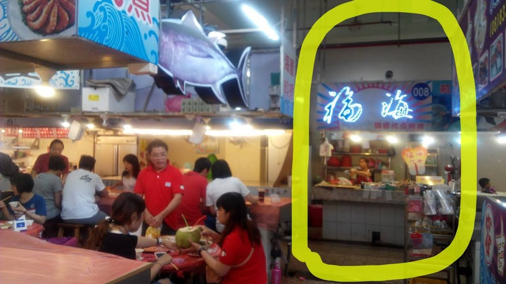
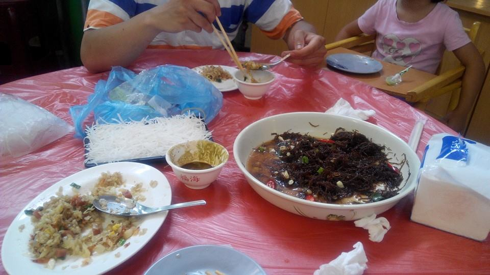
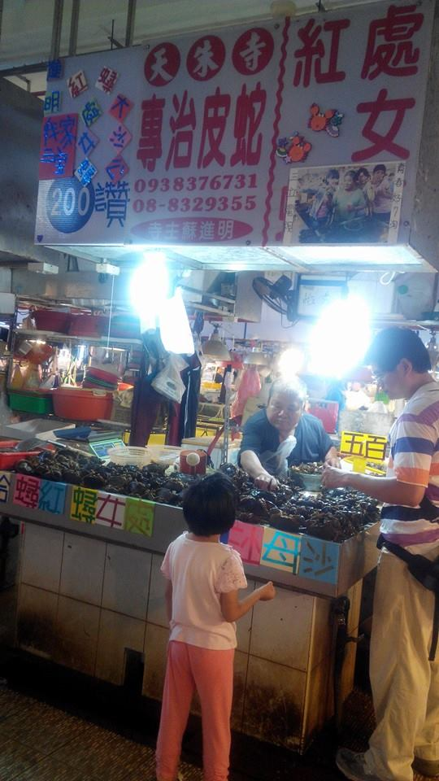

前天下午去嘉義東石，沒吃到想像中的鮮蚵，昨天中午在台南吃部落客推薦的阿憨鹹粥，大失所望(敝老公煮的虱目魚粥湯頭更棒)，今天去東港魚市總算滿足饕客的嘴，正港新鮮的生魚片，生蚵，活的海膽，還有這家自稱不好吃免錢的店，點了櫻花蝦炒飯和涼拌海菜，還買了四隻幾乎只要台北批發價半價的大沙公回家煮。爽，真是太過癮了！從小就住在魚港旁的我，東港魚市真令我驚豔，對愛吃海鮮的人來說，若是能住東港，實在太幸福了。

