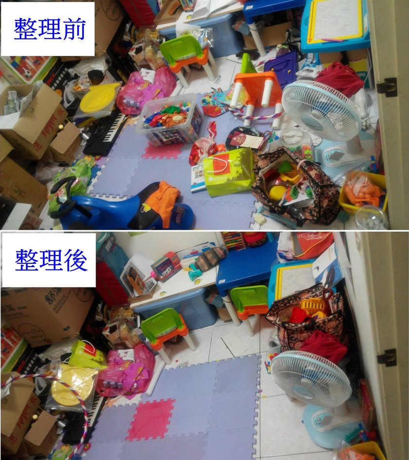

全家除了我以外，物品都不會歸位，垃圾也不會拿去垃圾桶丟，我忍耐再忍耐，直到我的工作做完的假日才收拾，好幾次整理一個房間就要花半天的時間，心裡明知他們應該都會收，只是懶得收，昨天我有意無意的暗示大女兒，妳們現在把小房間搞得這麼亂，亂到沒地方可以玩耍了對吧！妳明天如果可以把小房間收拾成像我當初剛整理好的那樣，我就給妳許一個願望(她想要沙畫)。大寶馬上爽朗的答應。今天傍晚，大寶想利用我煮菜的時間看電影，我反問他說，那這樣妳什麼時候有空可以收小房間呢？大寶馬上就去收拾，不一會兒的時間，真的有把玩具都分類歸位ㄟ，而且還有用抹布擦地板ㄟ~哇！滿五歲的小孩原來自理能力這麼強，我太小看她了。現在的大寶，不僅會幫忙做家事，也會自己洗澡，還會摺衣服(有分類)，Good！我真的好命囉！

