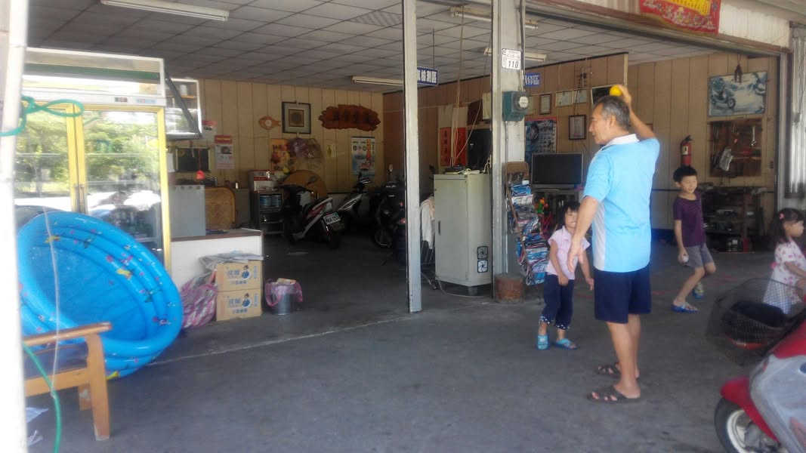
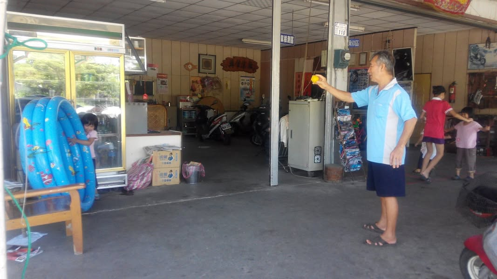
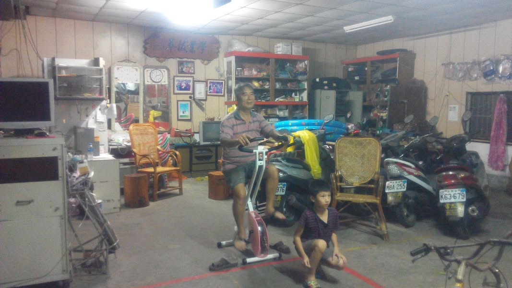
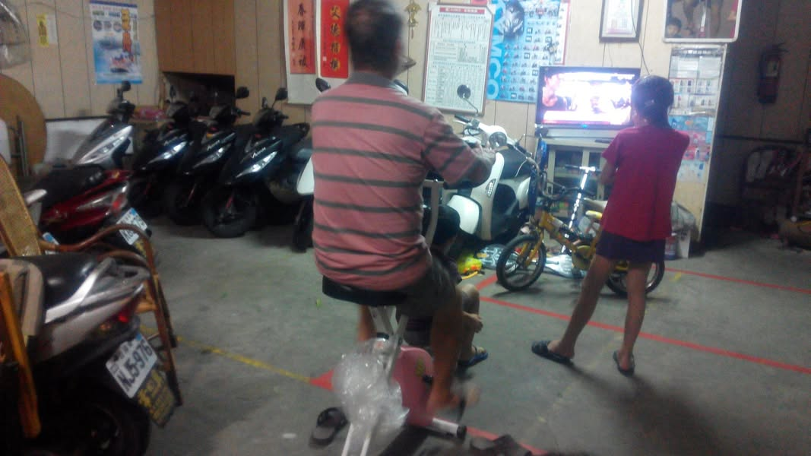
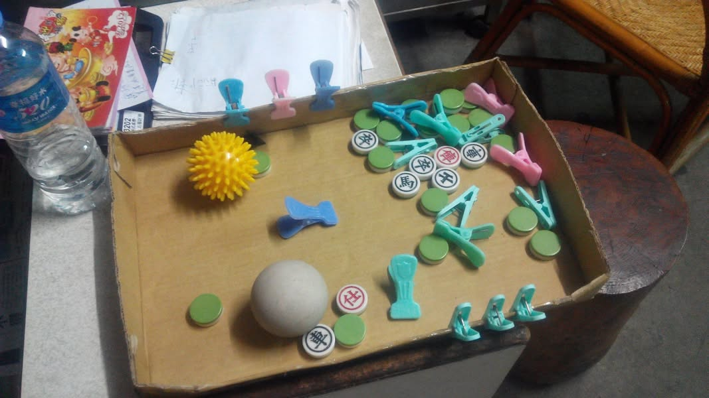

爸爸覺得去醫院復健很無聊，所以，我就利用家裡現成的東西，讓小孩陪著阿公運動。
1.上臂大肌肉擲球訓練(跟孫子比賽誰丟得準)
2.健身車訓練下肢大肌肉(邊看電視邊踩腳踏車)
3.曬衣夾與疊象棋 手部小肌肉訓練
 (看誰夾得快，贏五局得金沙巧克力一顆)
4.交叉步平衡訓練.......
反正在醫院有的復健內容，我利用家裡現成的東西改造一下，不需要舟車勞頓，又能讓阿公復健的很輕鬆，很有趣。

