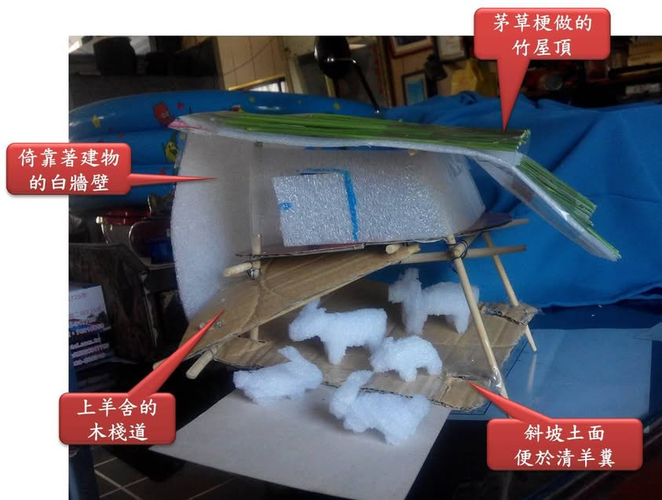
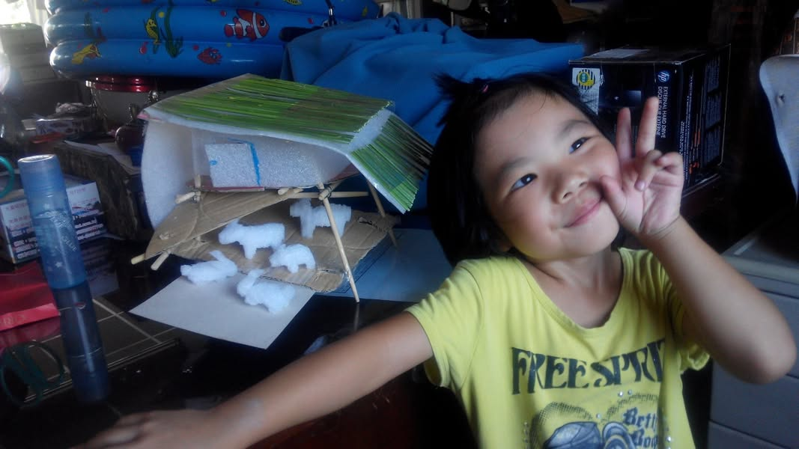
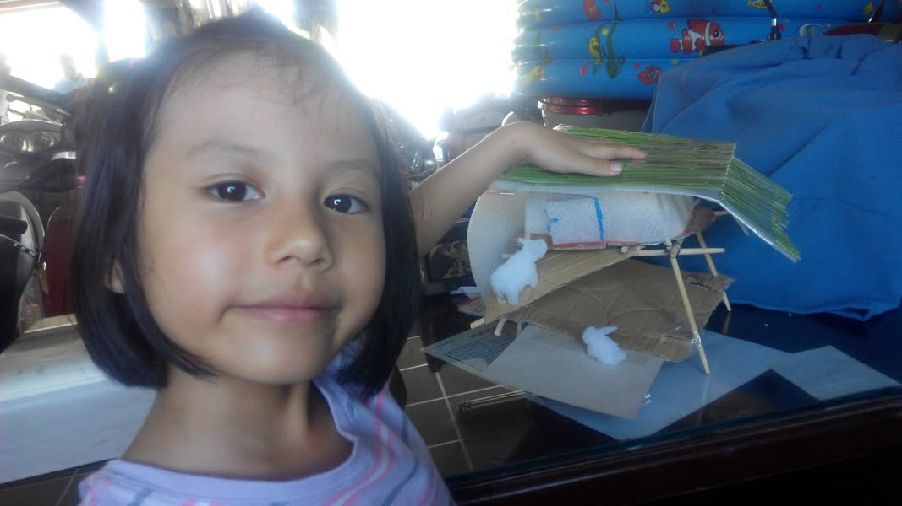
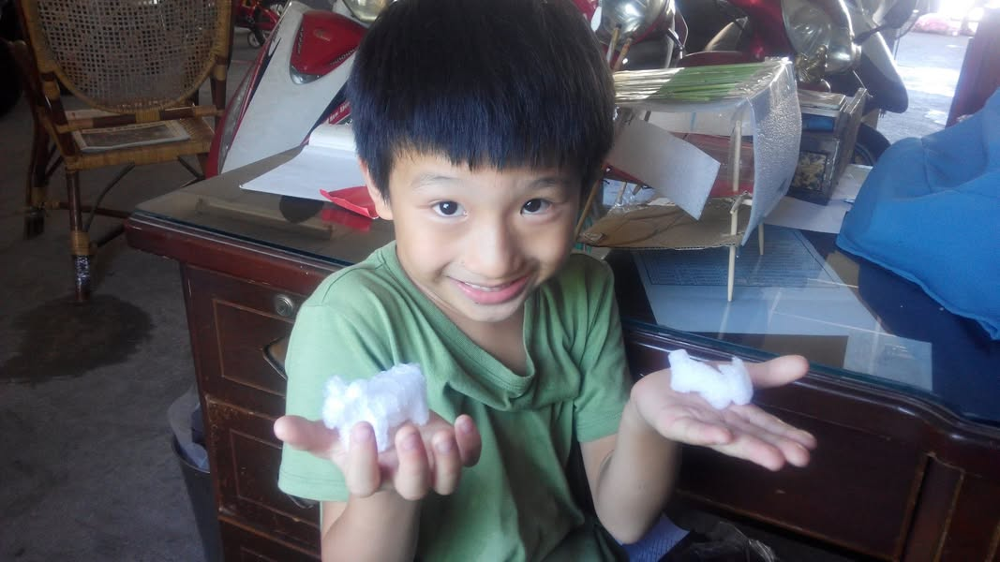

老爸的菜園連種了好幾年，希望純天然不施肥，現在作物都長得不太漂亮，很希望老爸再養幾隻羊，一方面把家附近的雜草吃一吃(我們才不會被蚊子叮)，一方面有羊屎可當有機肥來沃土，小朋友來阿公家還有羊可以玩，一舉數得，為了讓阿公不再敷衍我們(因為去年就答應大家說要養羊了)，這次，特地跟小朋友們把羊舍的模型給做出來，讓阿公明白大家對羊舍與羊咩咩的期待，也讓阿公更有復健的動力(因為要趕快好起來才能蓋羊舍)。
材料:
羊舍本體：廢棄的紙箱、竹筷與泡棉
屋頂：野草與泡棉
牲畜：泡棉(兩隻羊、兩隻兔、一隻豬)

