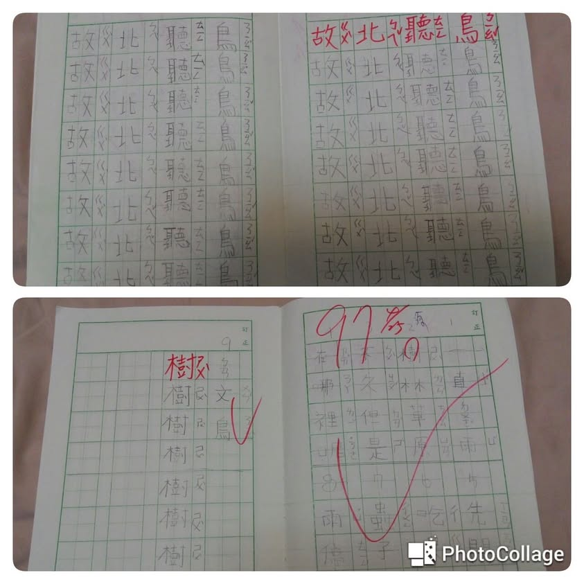

大寶剛開始寫的國字，非常亂，不端正，老師會要求學生把考聽寫時寫錯的字，再訂正寫一行。為了讓大寶專心寫字，避免錯了要訂正一堆，我跟大寶說:老師說寫錯一字要寫八行，是老師看在妳願意好好訂正，所以同意讓妳寫兩行就好。這個我捏造的規矩就這樣施行了好幾個月，大寶也曾跟我抱怨說，她的作業本都比別人快寫完，我說，那妳就要加油，認真寫，錯的少，就罰寫的少啊！
今天，大寶跟我說:"媽咪，我拿聽寫本問老師我可以只寫一行嗎？老師說:可以啊！我從沒要你寫兩行啊！"   大寶狐疑的表情問我說:"老師是不是忘記她有這樣規定我過啊？"
嘻嘻…大寶啊！雖然妳莫名的多罰寫這麼多國字，但，現在，妳錯的字已減少許多，只寫一行，媽咪也同意囉！

