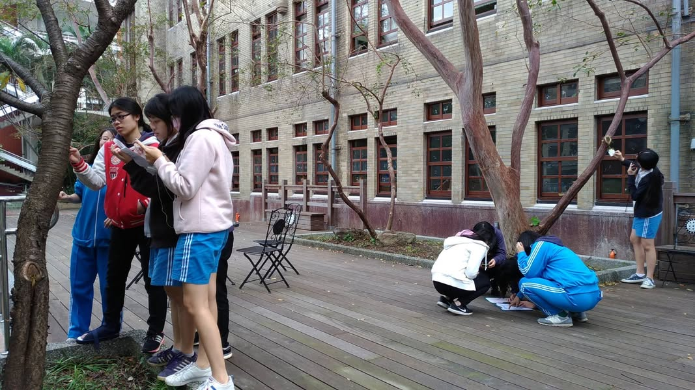
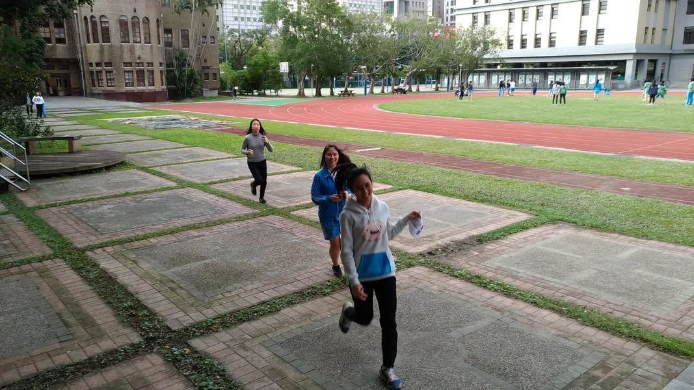
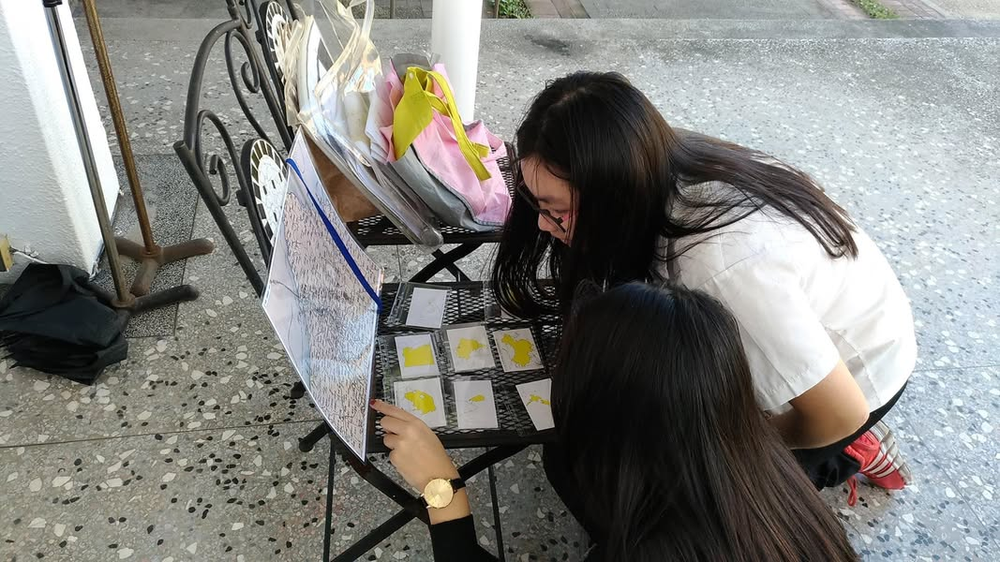
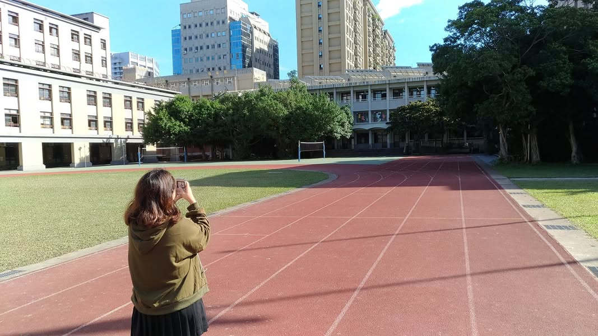

施行多次的校園地理實察，在今日的大好天氣下，完美的驗收了！
看學生快步奔跑於關卡之間，努力的找尋卡片，專注使用羅盤傾斜儀測量方位和角度，即使這樣奔波了一小時，仍不願放棄，還想繼續挑戰下一關，樂此不疲的探尋，追求一次又一次的突破，我問過關學生的心得是什麼？大家異口同聲地說:「好累！但是好好玩！發現原來校園裡有這麼多不同的植物...」。總算讓同學快樂的，有效的，活用課本所學的知識與技能，並透過闖關習得更多相關知識(辨識植物、野外求生)了，下次打算增加更多歷史味(古蹟巡禮??)。
雖然實察在高一就教了，但，在高三學測前搞一個整合性的競賽實察，一來可讓她們在學測前活用實察工具，二來也讓她們在畢業前，透過尋寶，來個校園巡禮，當作畢業前的回顧。三來，讓整天考試讀書的高三，有機會下來奔跑同時活化腦細胞....， 可謂 一舉數得 呀！

