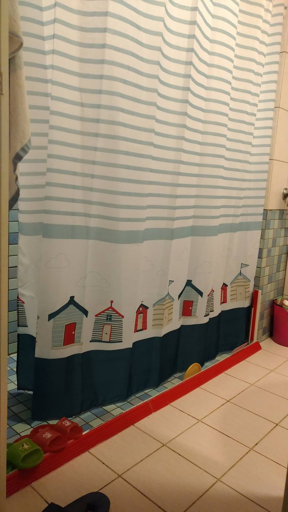
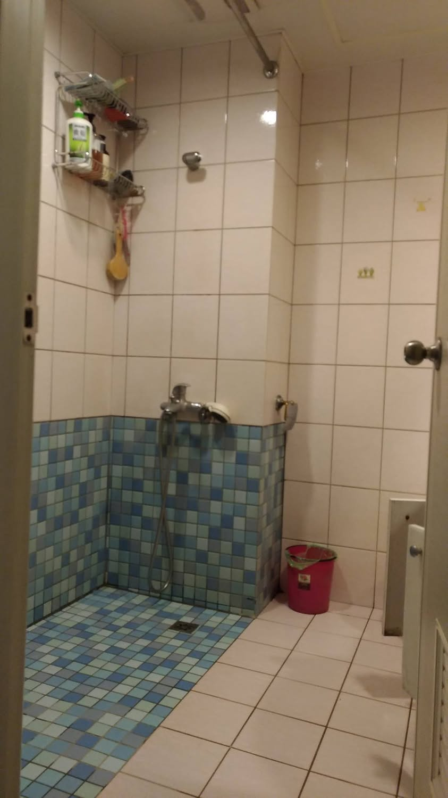
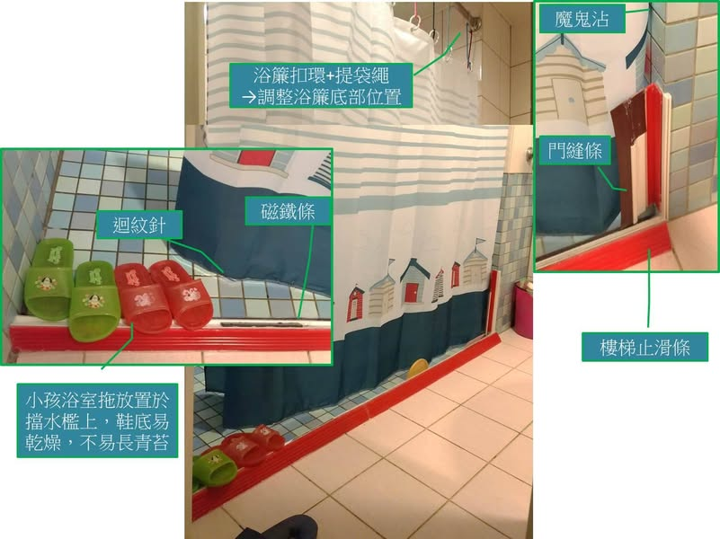

十年前搬到現在居住的房屋，把浴缸打掉，裝上人造石門檻，使用浴簾，期望達到乾濕分離，因為簾子底部太高，實際上擋水效果很差，用沒幾年，人造石門檻的矽利康也發霉了，索性拆掉，讓小孩能在小游泳池泡澡。
又經過了幾年，溼答答的環境，浴櫃門的角鍊都鏽蝕了，木板也有些爛了，鐵鏽常掉下來，恐有阻塞排水管之疑慮，前幾天團購了雙面自洗拖把，想說，辛苦點，每天把浴室地板擦乾，但，一個禮拜下來還是覺得挺費工，於是我又認真思考乾濕分離的浴室了。
有想過乾脆裝個淋浴門，但我家浴室其實小小的，裝上去會撞來撞去，想了很久，最後還是走回老路，但，這回我自己做，以改善之前遇到問題為目標，矽利康也買長效防霉的，希望能一勞永逸。

猜猜看我用什麼來替代人造石門檻呢？

第三張相片有答案

