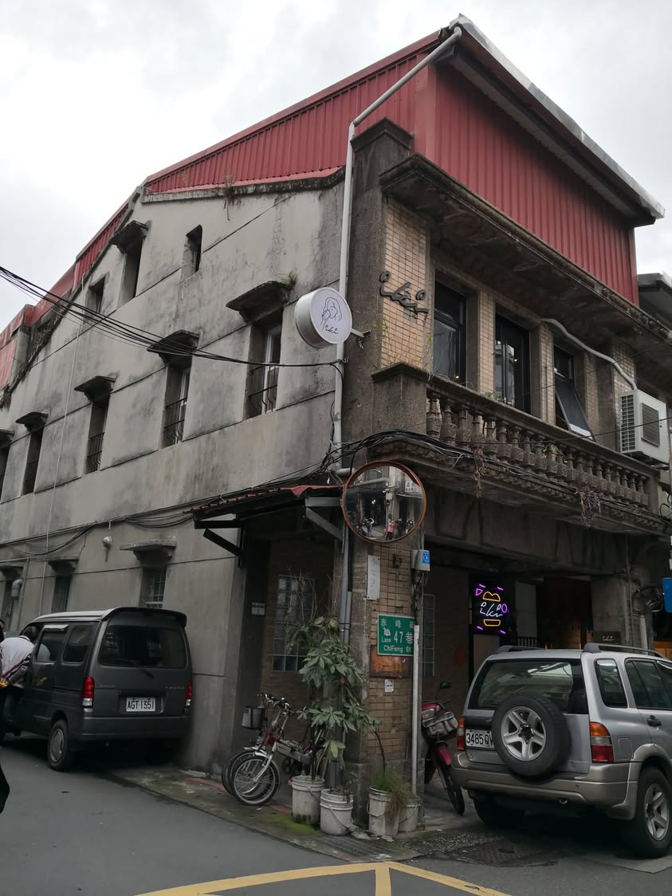
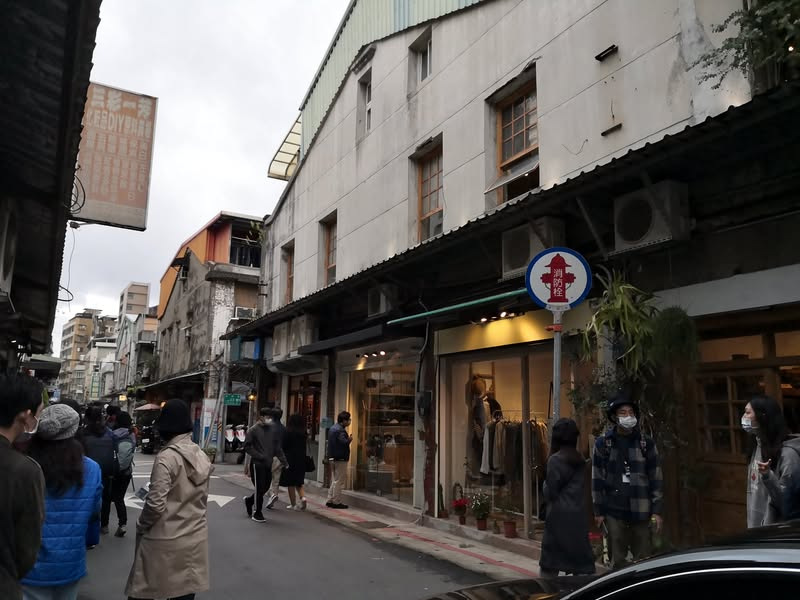
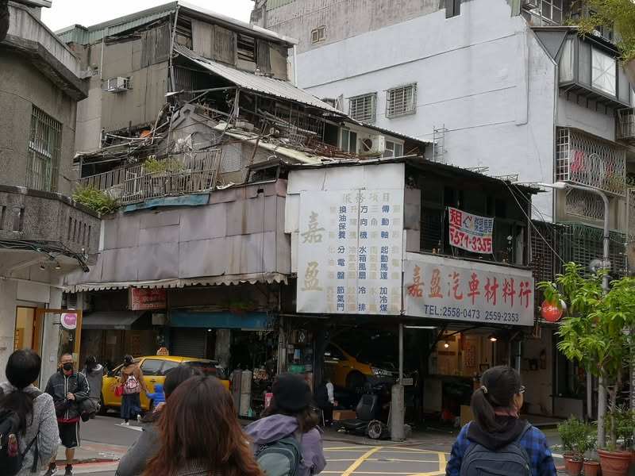

跟著社區規劃師走進大同區的巷弄中，從二樓陽台的斗栱裝飾以及磁磚樣式可推論此區房舍原為日治時期蓋的兩層樓街屋，一樓店面整修得頗為亮麗，但三樓卻都是醜陋至極的鐵皮屋，回程搭著公車望著台北不同時期的建築，初步結論，有貼磁磚(二丁掛)的房子都蓋得蠻醜的，為什麼會這樣呢？看了這篇文章，就明白了，台灣人的美學素養真的得從小扎根、好好提升才行。https://www.thenewslens.com/article/28405

