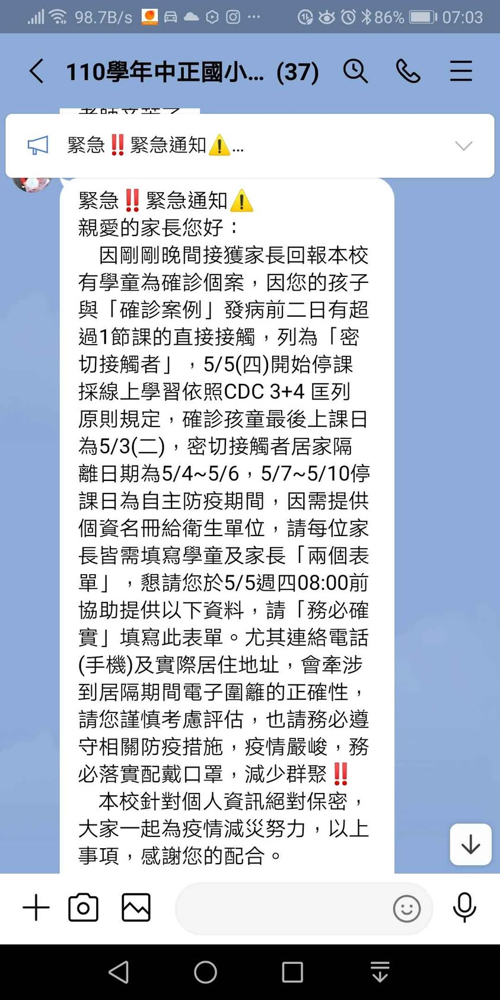
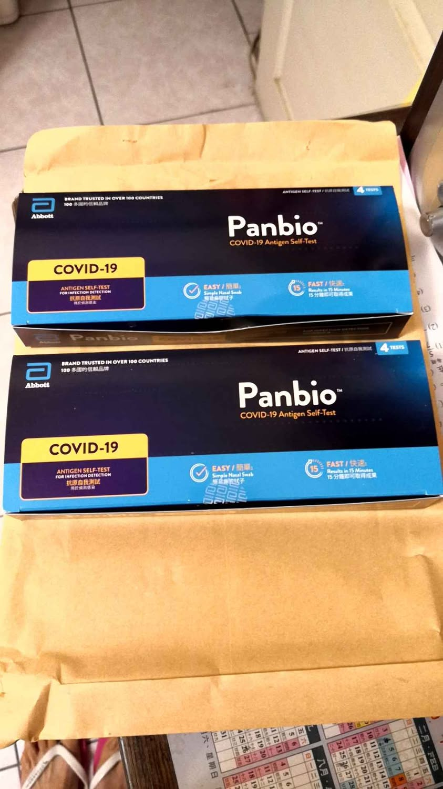
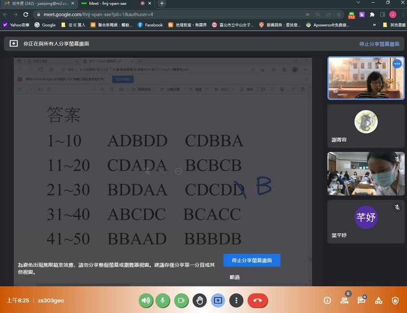

昨天早上準備上班上學時，看到line訊息說小寶的班級有人確診，要居家隔離3+4，先填完匡列的表單，才能領快篩，之後向任職的教務主任報備，並通知第一節課的班級要準備教室內線上直播。第一節課有點手忙腳亂，想要同時聽到學生和線上老師的講話一直試不出來，一直有聲音回授的問題，試了半天只好老師線上講話，教室擴音機播音，用平板或手機架在講桌上，讓老師可以看到學生！如同學生在線上上課一樣，透過舉手或是比手勢讓老師知道同學的理解狀況，勉強還行。

下午，國小通知可以領快篩，請沒有陪同居家隔離的爸爸去領取，居隔學生2份，陪同隔離的家長3份，晚上快篩後，兩人都是陰性。
又開始在家線上上課的日子囉！(只是這次我不能出門，辛苦爸爸採買物資和接送大寶囉！)

