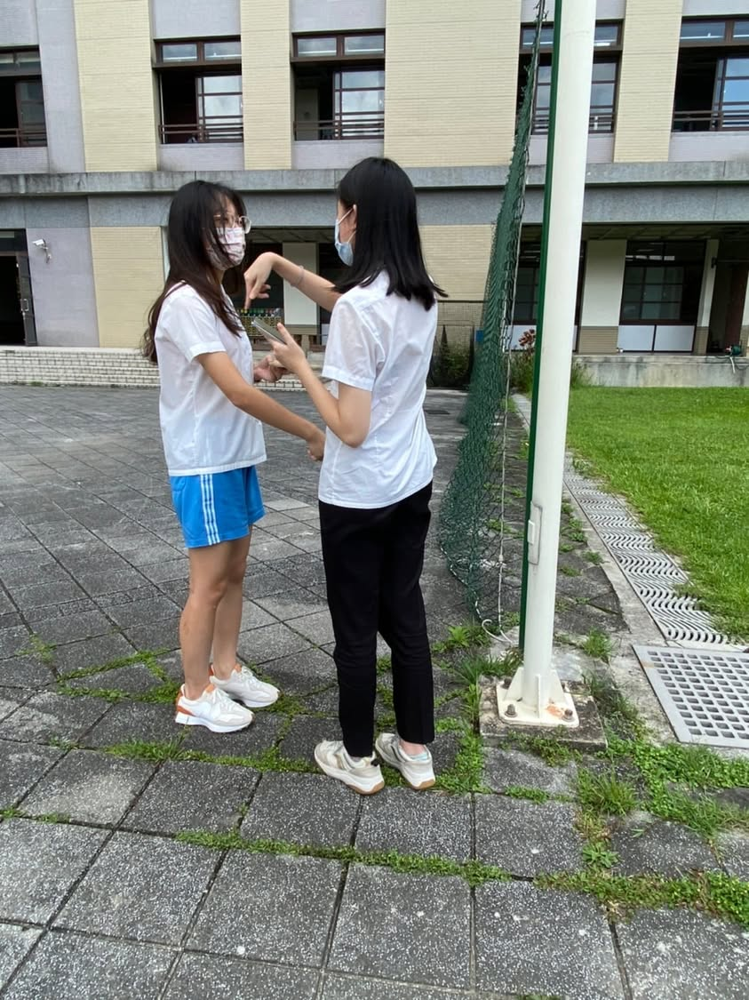
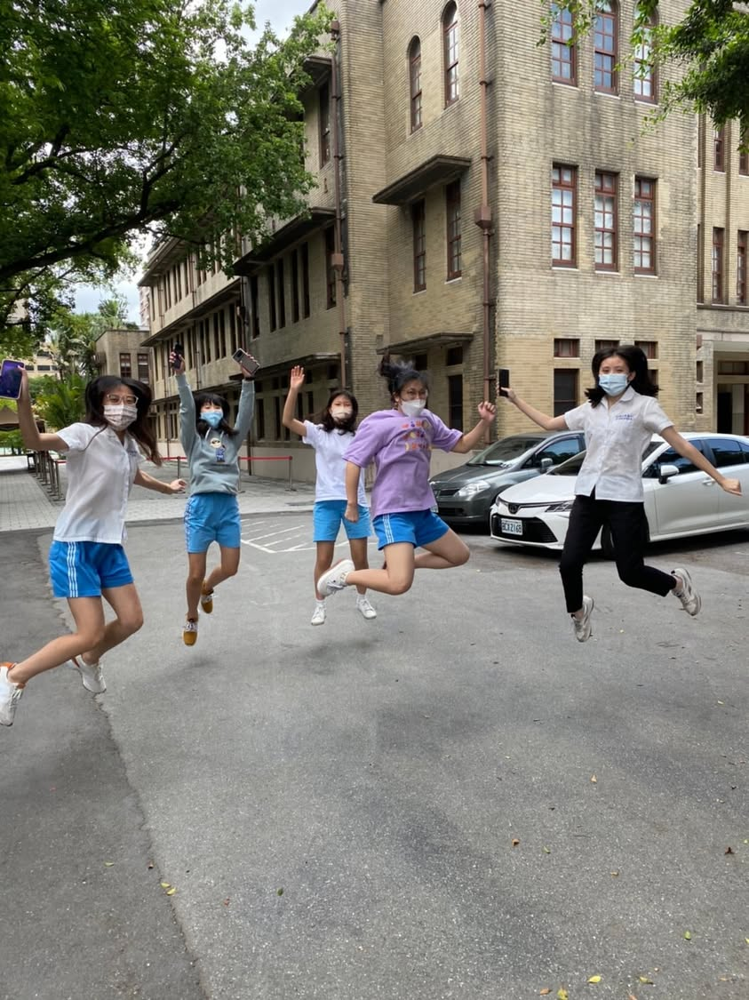
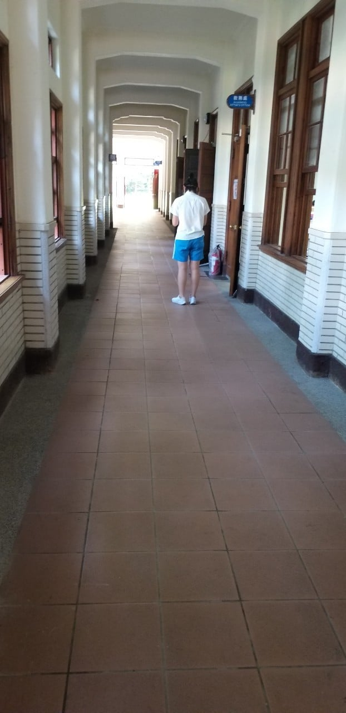
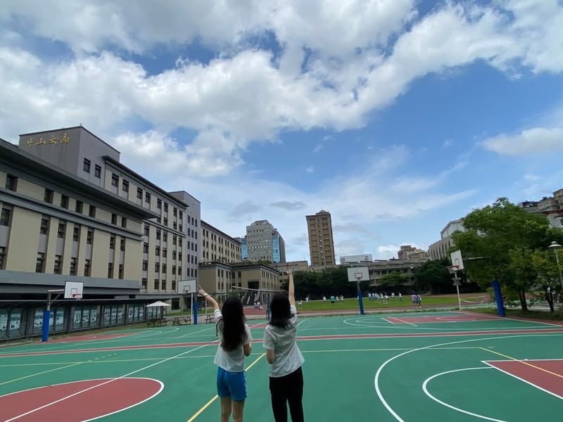
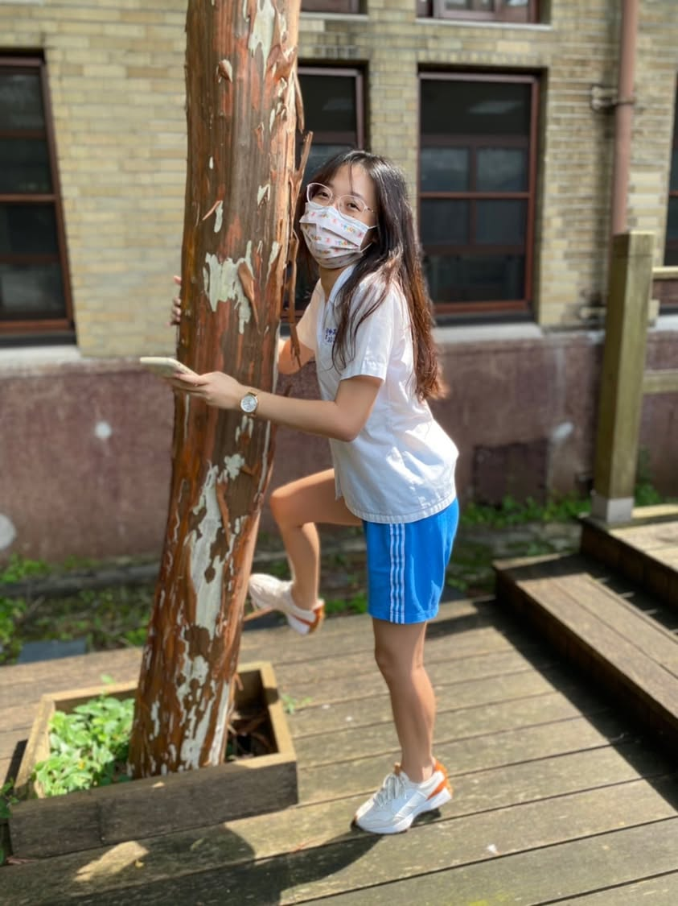
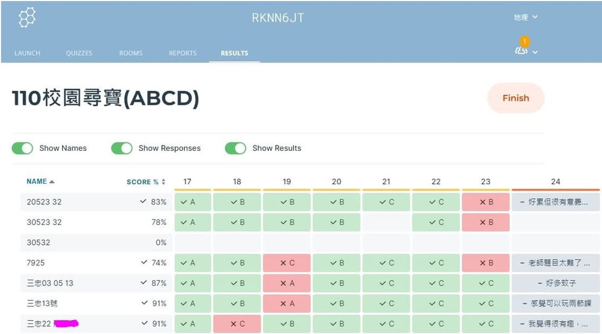

每年高三畢業前 我都會讓同學進行校園實察， 一來是活用所學的地理技能，二來是讓高三生在畢業前再一次校園巡禮。
以前都是實體翻牌找線索，去年我改版成線上解謎，今年因為疫情實體課有限，本來沒機會實察的，但剛好有一班今天有一節課的機會可以實境解謎，而我因為居隔本來就和學生meet上課，於是今天就讓想要參與校園實察的同學登入socrative，根據題目在校園中找線索完成闖關遊戲，我在線上不僅可以看她們的闖關進度，也可以即時透過meet跟學生對談，在遠端統御全場，比實際在現場南北奔走備詢有效率多了。
原來校園闖關遊戲特別適合從遠端連線上課呀！

只要請同學回傳解題關鍵的情境照到班群，就可以有多個解題場域的最佳側拍照片了。 同學互拍，比老師側拍的有趣多了。

