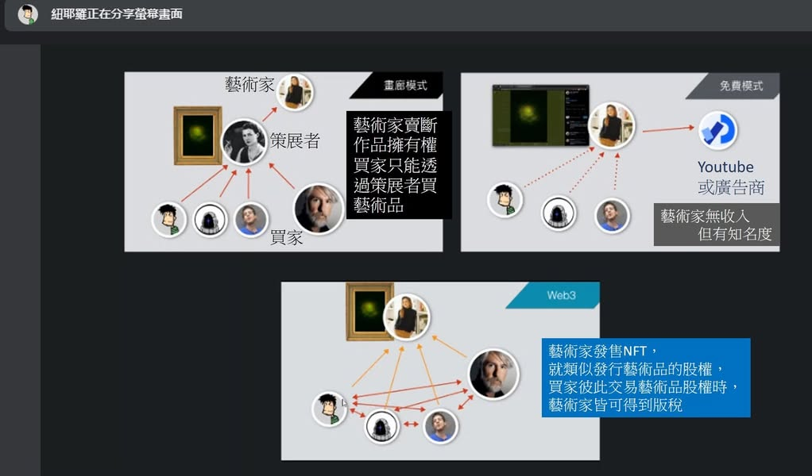
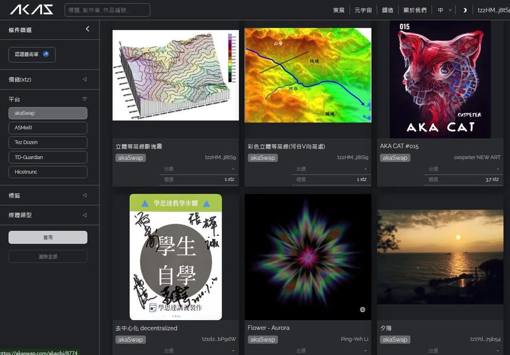

昨天早上參加校內舉辦的NFT研習，獲得講師贈送的3.5元tezos幣，買了托哥巨嘴鳥NFT。
今天把我自己的作品上傳，這樣就可以證明此作品為我原創了。
雖然目前交易NFT的平台看起來都是美術作品，但，我覺得具有智慧財產權的東西應該都適合鑄造NFT。
區塊鏈和NFT似乎有泡沫化的現象，但在Web3.0使用區塊鏈虛擬貨幣的世界中註冊自己的原創產品，再透過網路無遠弗屆的傳播力交流分享，這樣保障原創者的著作權的觀念應該是不會泡沫化的，有NFT的原創品便可更放心地公開分享而不用擔心抄襲了。

https://akaswap.com/metaverse?page=1&collections=akaobj&sortBy=swapTimeDesc

