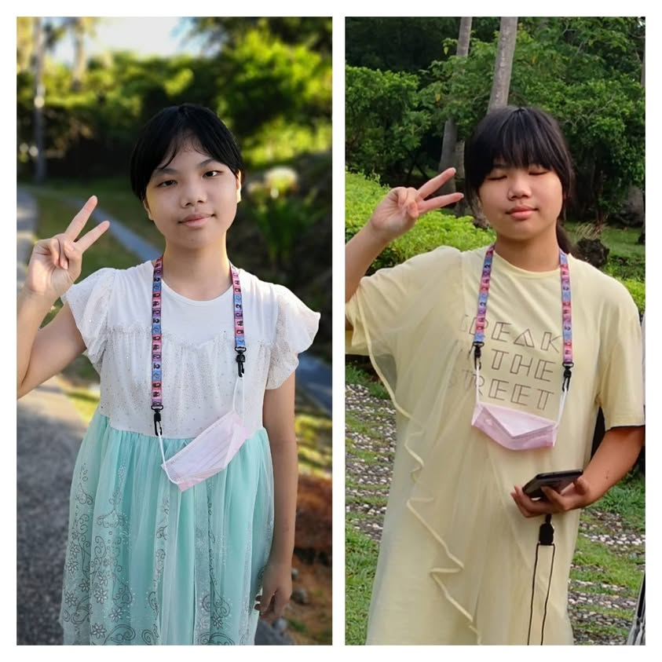
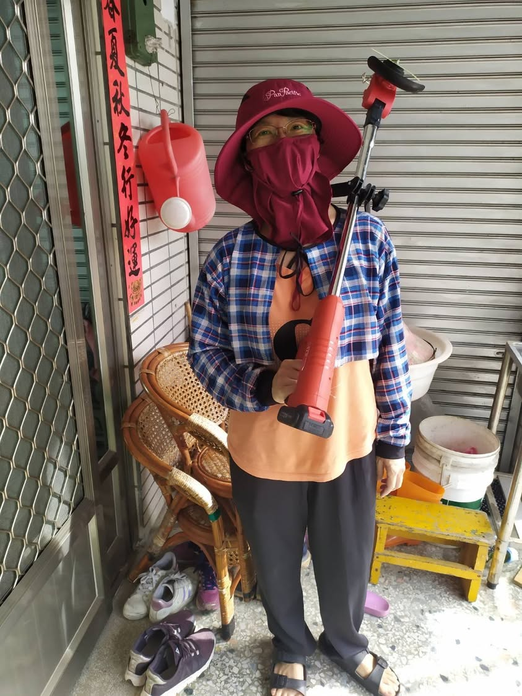
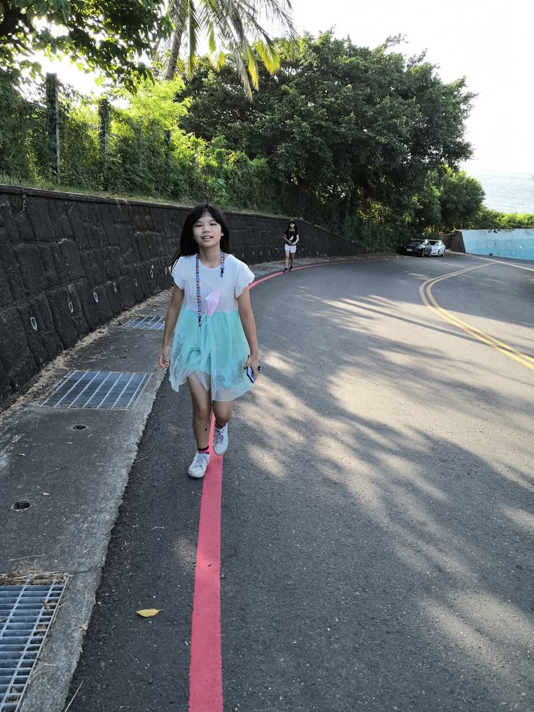
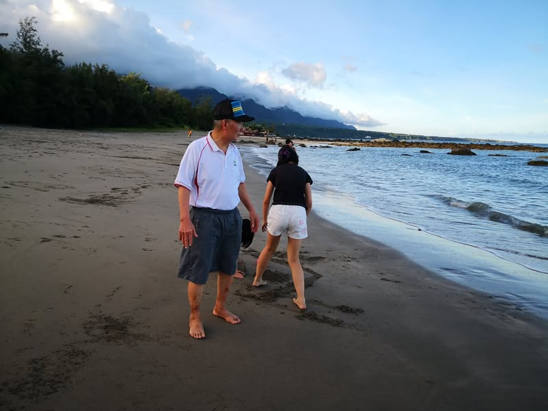
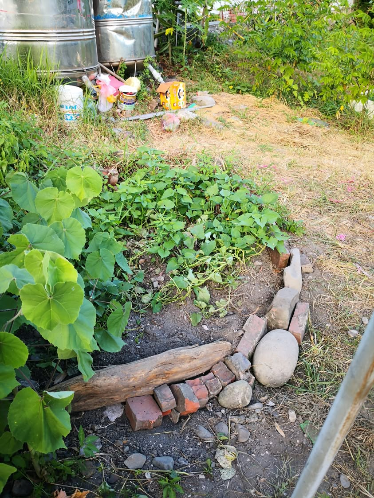
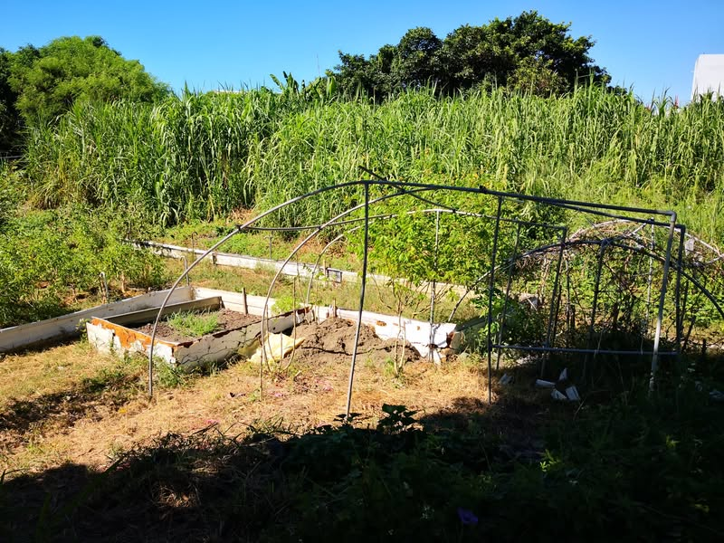

在台東的後半段時間維持每日都要動的原則，除了早上帶小孩走去小野柳之外，也幫媽媽除草(我不想用手，太累了，所以買了一台電動割草機21V的，割田裏面的雜草剛剛好)，還整理已經崩坍的斜坡地瓜葉菜園、搭設攀藤類植物的棚架，還去溪流邊挖土，補充田地流失的土壤，每天一身汗，衣服濕到可以滴水。
每天動態兼田間勞動的生活，我和兩寶都瘦了也精實多了，爸爸每天晚上走村莊一圈，增加了運動量，精神氣色體力都好多了。
7/23回台北了，沒有台東的好空氣和涼風了，若要在台北悶熱的天氣下維持每天至少運動1小時的習慣，恐怕只能在冷氣房了。要不然就要改成夜間運動了。

