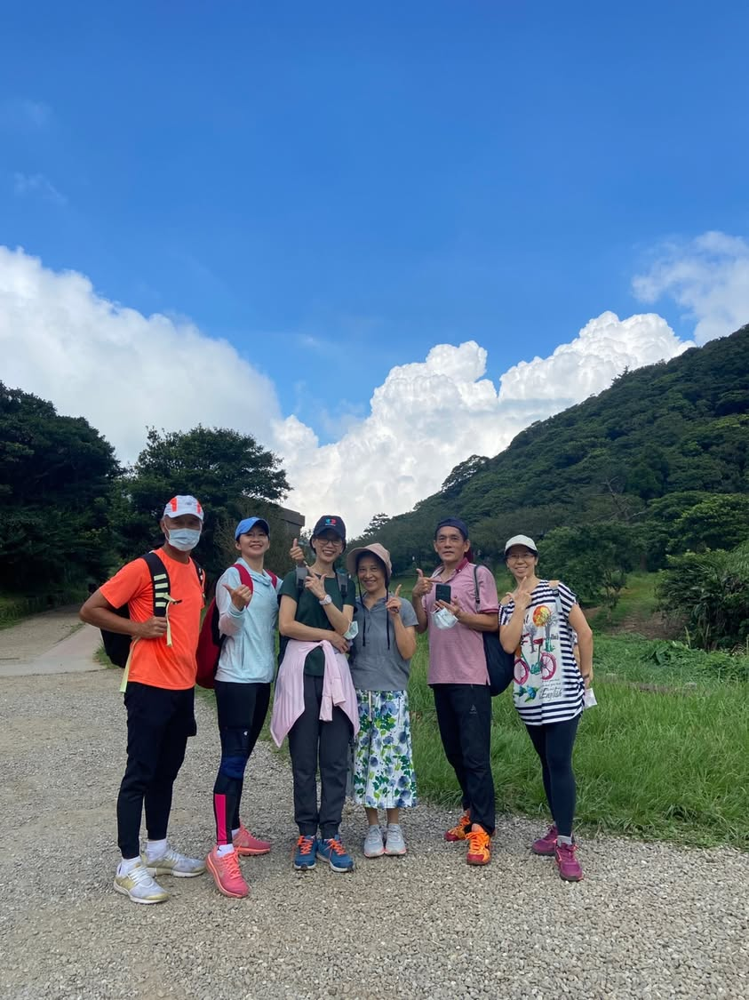
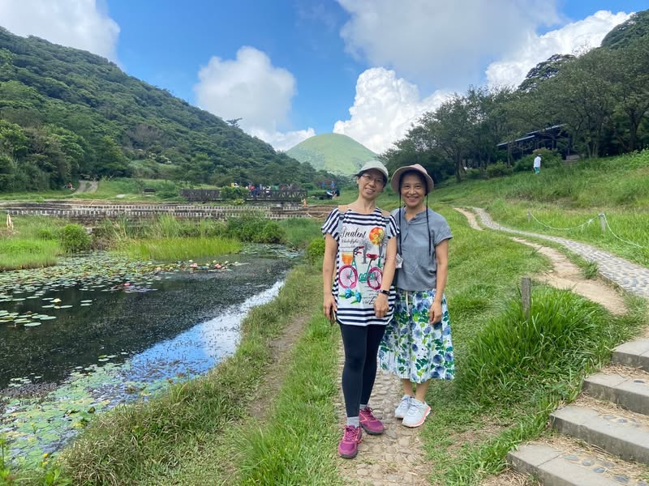
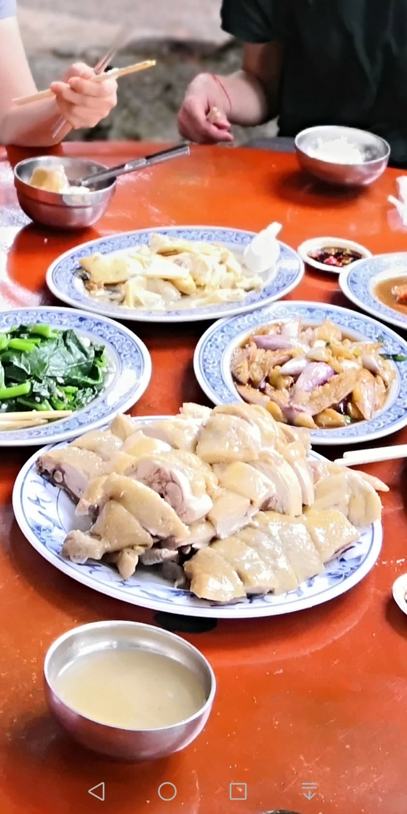
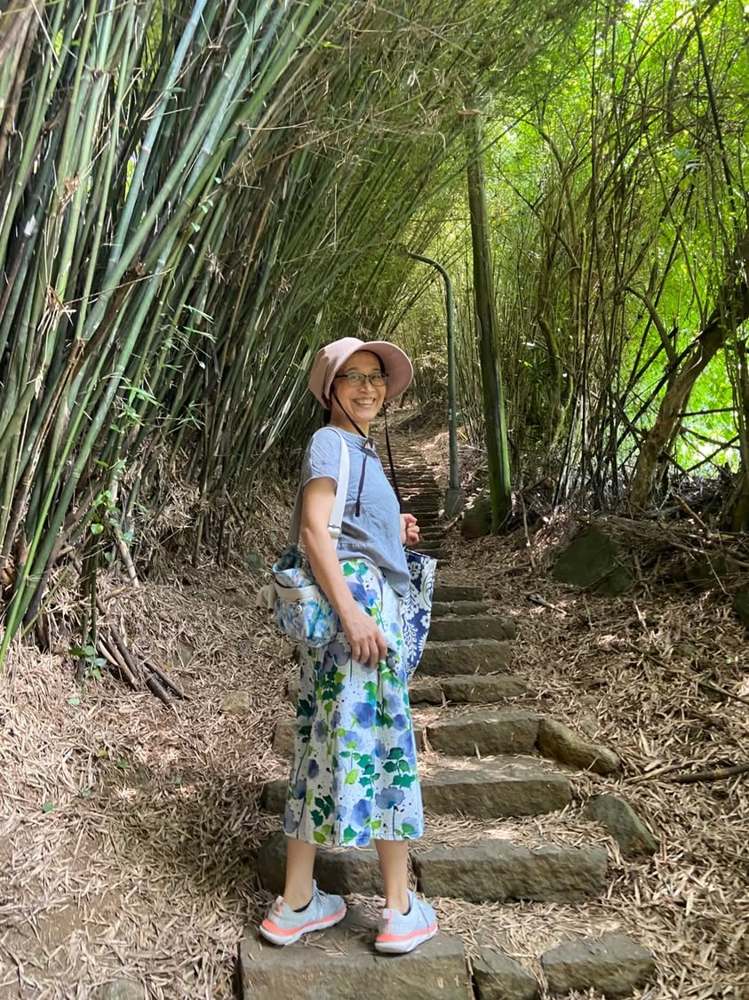
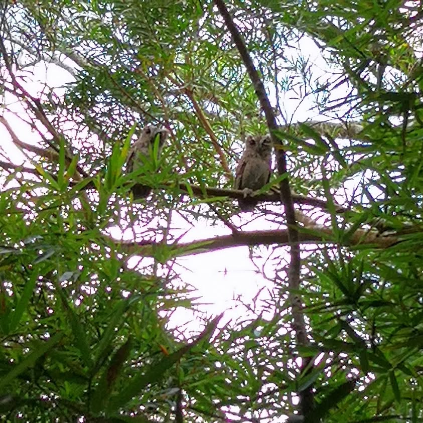
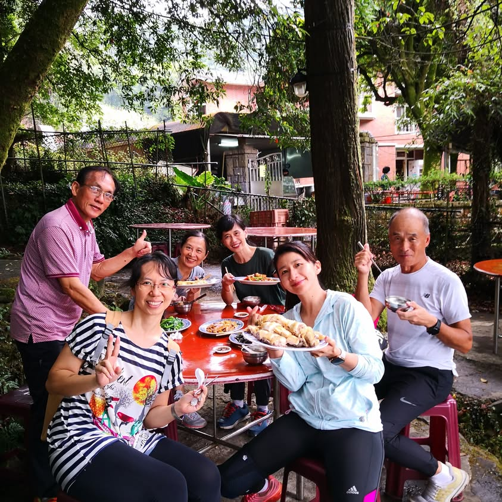

真的很幸運能有機緣成為美惠英文班的成員，老師們各有專長，大家互相交流、互相學習，一學期一次的出遊因為疫情延宕了兩年，好不容易終於敲定了8/15大家一起同遊二子坪步道，再圓一同出遊的夢想。

早上八點台北市31度，上到二子坪，氣溫25度，多雲時晴的好天氣太適合健行了！在蓮花盛開的二子坪遊憩區開心地拍照後，大家都說要爬上前方那座"饅頭山"，也就是"面天山"，在岔路口本想右轉朝"面天池"方向走去，但"美惠老師說:那條路我走過了，我們今天走走不一樣的路"，於是大家就朝著"清天宮登山口"的方向走去，一路上都是下台階，我越走覺得奇怪，不是要去爬面天山嗎?怎麼會一直下坡，幾乎都走下山了還是決定問一下山友此路前方是哪裡？一問才知原來我們是從山上走向登山口，根本到不了面天山呀！只好走回頭，此時一直走在前方的美惠老師，俏皮的回眸一笑說：「謝謝你們陪我走不一樣的路」，哎呀！原來熟悉對陽明山步道的美惠老師早就知道我們這樣走根本到不了面天山，但她很想探探不一樣的步道究竟會通到哪裡，謝謝我們陪她一起探險。
ok! ok! 這次沒上去面天山，老師說下次再來爬，耶！賺到一次下次再來爬山的機會！

走回到二子坪停車場時已經13:10，驅車前往竹子湖，「山園野菜餐廳」，一家在天然森林樹蔭下用餐的餐廳，是疫情期間出遊用餐的好選擇，用餐前的一場陣雨，替我們洗淨了餐桌，清爽又澎湃的山野好滋味滿足了饕客的胃，放山雞好大隻超好吃超划算，他日定會再訪。 用完餐後沒多久，大家都上車後，開始飄雨，接著下大雨，哈哈！那就下山吧！為今日的出遊旅程劃下完美的句點。 

感謝天公作美。健走時給我們涼爽有風的好天氣，在我們用餐前下場雨幫我們洗淨餐桌，在我們用完餐後下場雨告訴我們該下山回各自的工作崗位囉！健行過程中，我們都沒有淋濕，真的是天時地利人和配合得超好的一趟旅程。
詳情參見 https://www.facebook.com/fiona.huang.100/posts/pfbid02noRaFAELqWvWv3yu8ZRd5wpEPPYYfoveHMH3mAeeNHsvk4weoJZK8sRfWMbzEf5Tl

