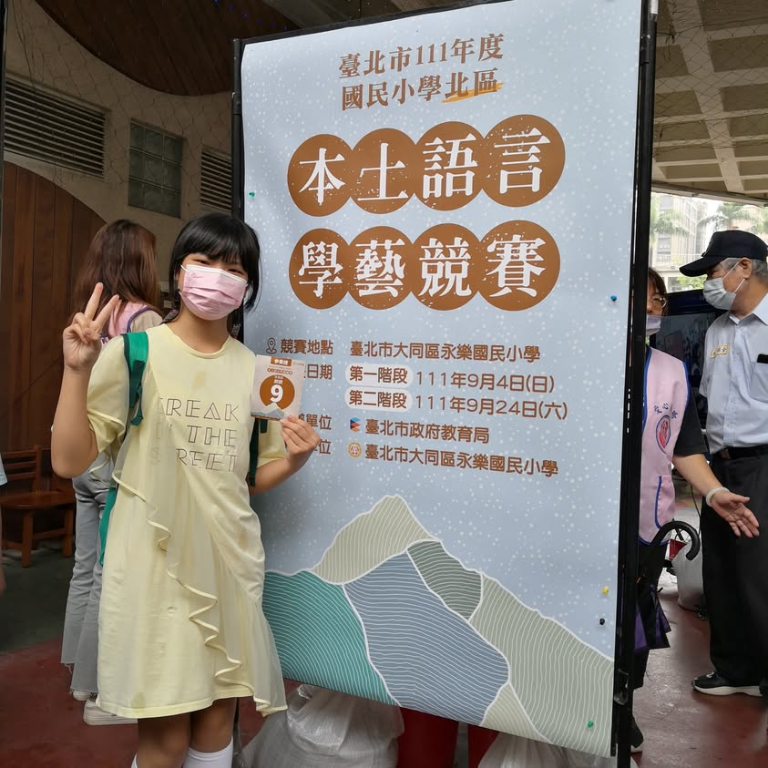
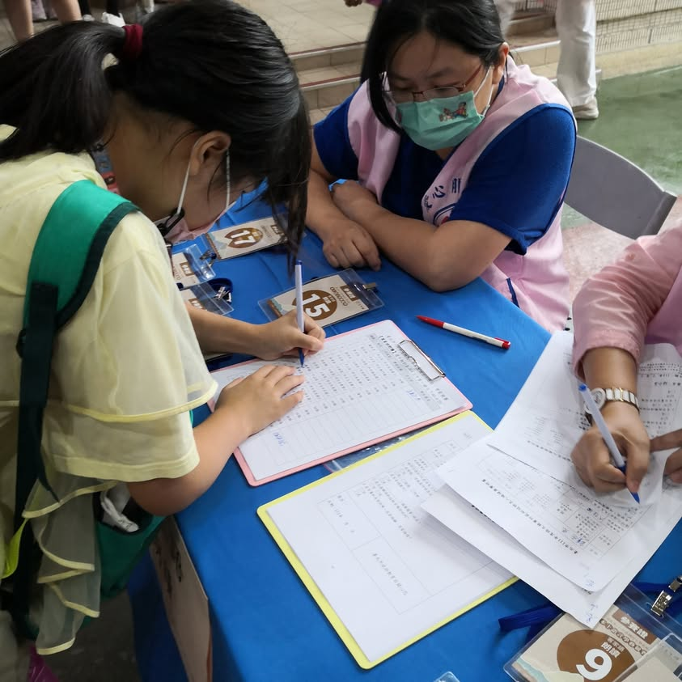
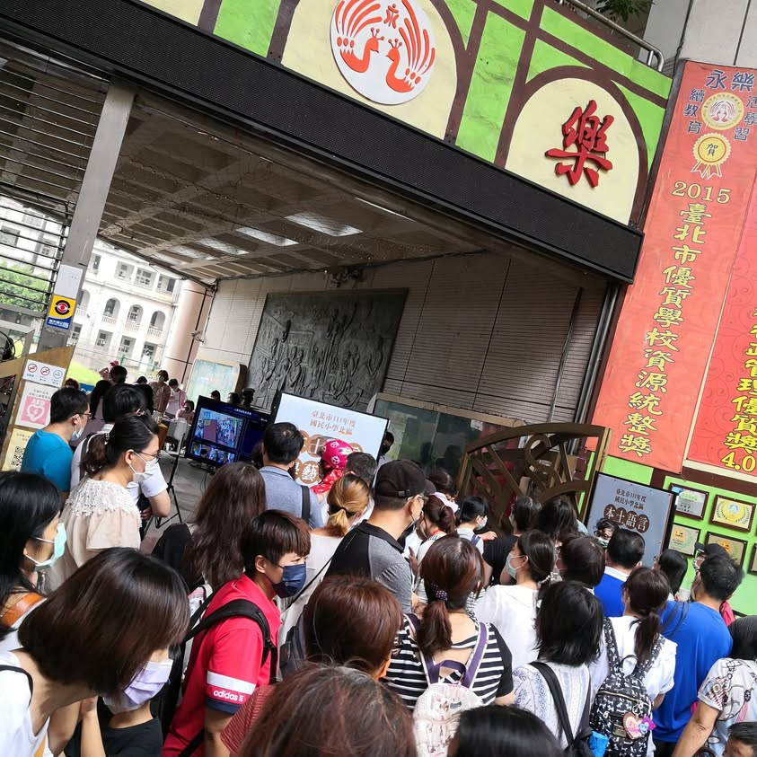
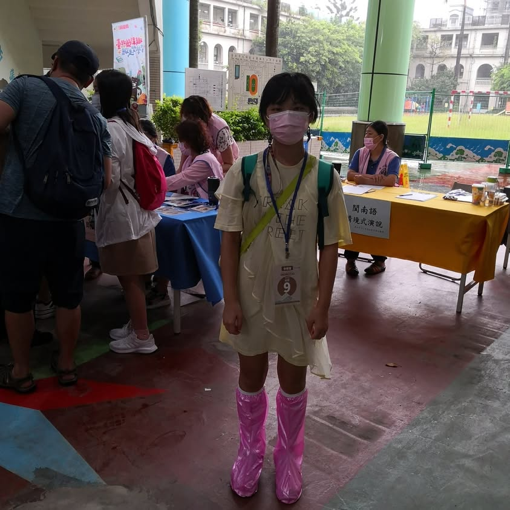

颱風天一大早(7:30)就前往台北市永樂國小參加客家語朗讀比賽。 這是小寶第一次代表學校參賽，隨便穿穿，沒想到，現場的參賽小朋友都有特別打扮ㄟ。 門口人擠人，我就先帶小寶進去報到，害領隊老師等不到人，打電話給我才告知她小寶已經進去準備比賽了。
今年因為防疫，家長老師都不能進校，我走到迪化街逛逛，晃到10點再到永樂國小門口等候小寶，等了將近30分鐘小寶終於出來了，
小寶說，現場每個人都念得很好，大家果然都很厲害。

