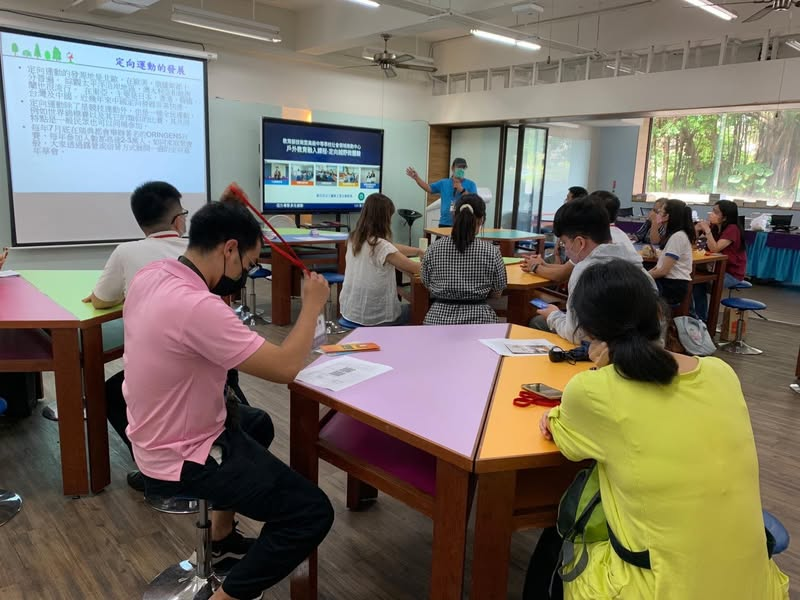
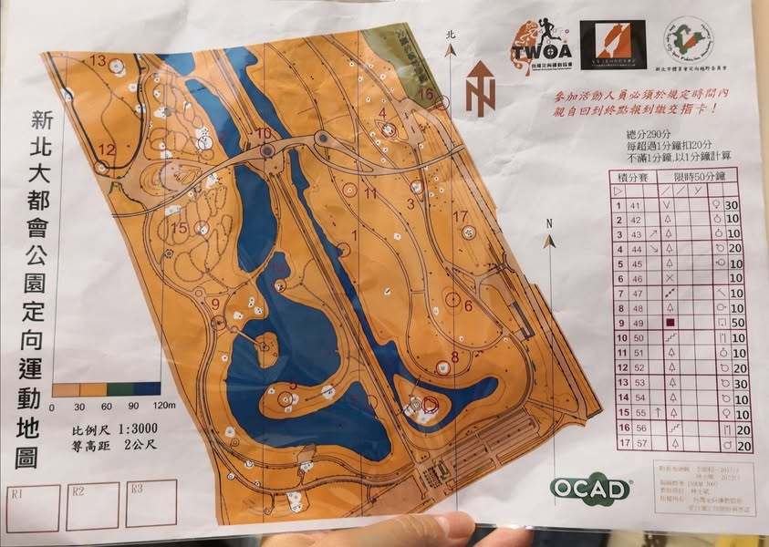
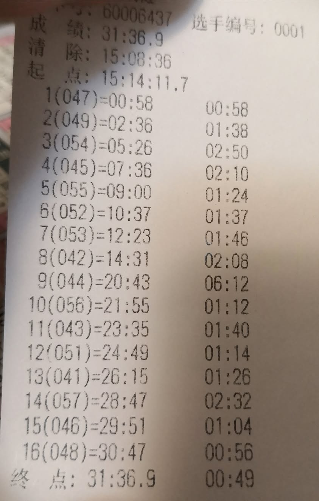
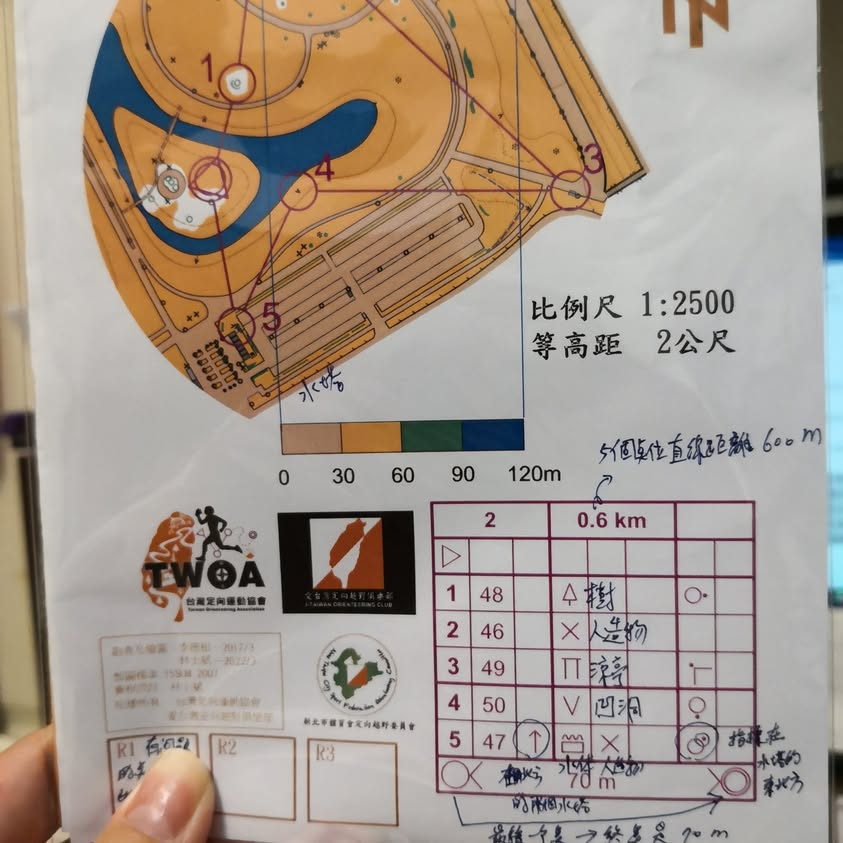
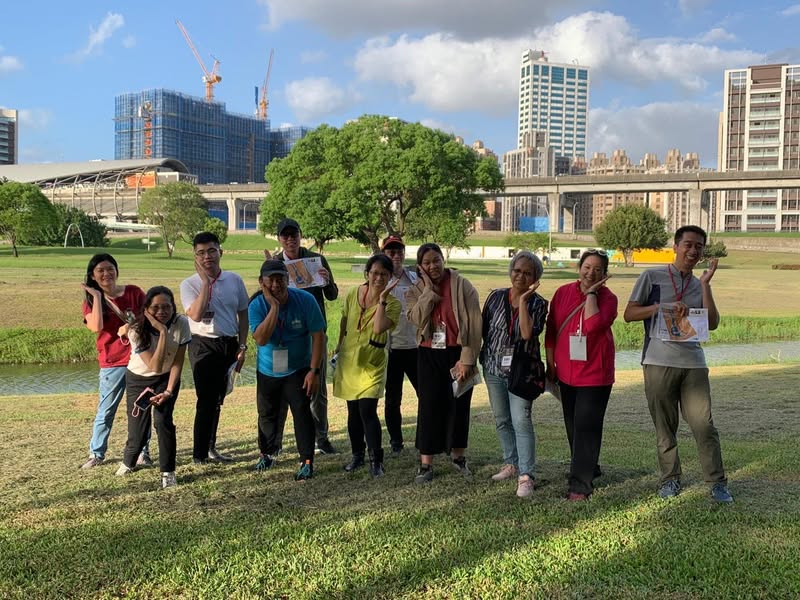

今天到三重商工參加戶外教育融入課程-定向越野微體驗的研習，這場研習本在5月中舉辦，因為疫情而延至九月中，星期二本是我課最多最滿的一天，為了要參加這個研習，我調開了下午的三節課，來到我最熟悉的大台北都會公園參與定向越野的研習。這是我第二次參加定向越野的研習，又是在我最熟悉的地方，我可以完全掌握並更深入的探究講師是如何安排點位，在地圖上又是如何來呈現每個點位的特徵，雖然下午3點在大公園裡玩定向有點熱，但還好是秋天、有涼風，我撐著洋傘悠哉悠哉的踩點打卡，憑藉著對大都會公園的熟悉度and對地圖判讀的敏銳度，輕輕鬆鬆成為第一位完成所有關卡的學員。

感謝講師仔細地回答我的每個問題，使我可以更明確的知道如何將定向越野融入戶外的實察課程。

