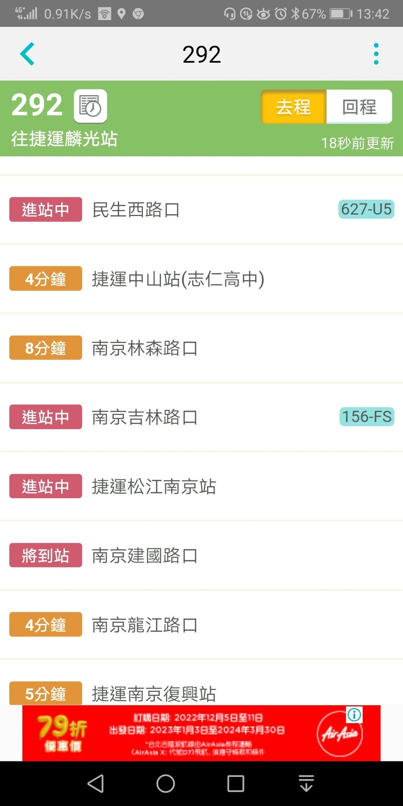
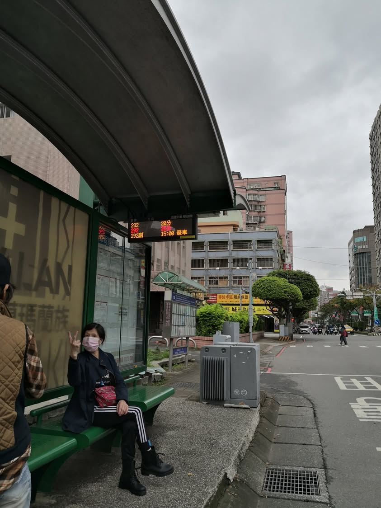
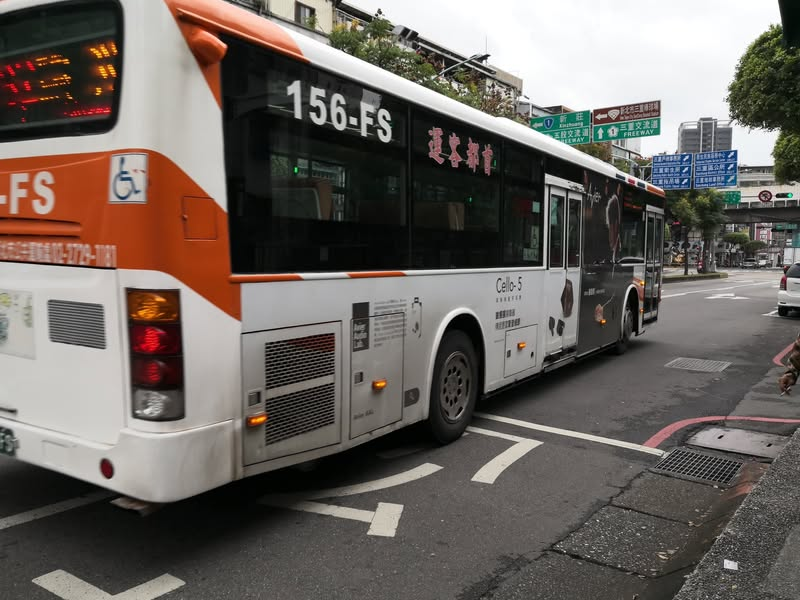
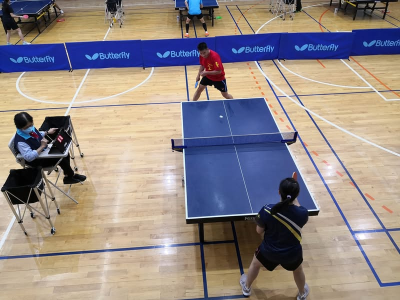
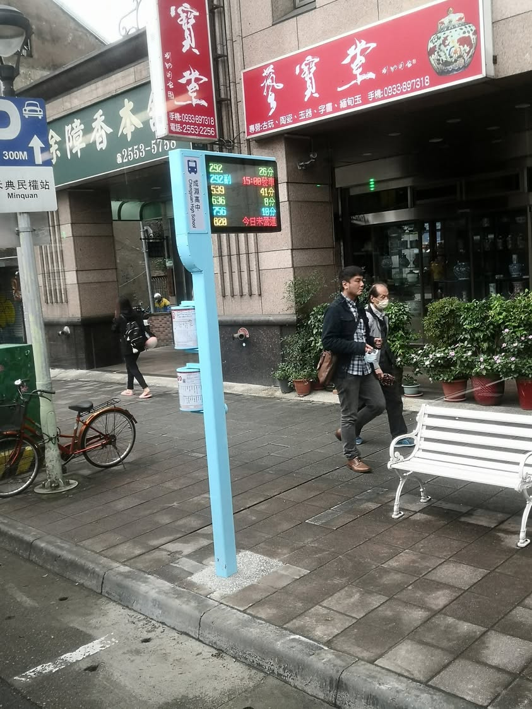
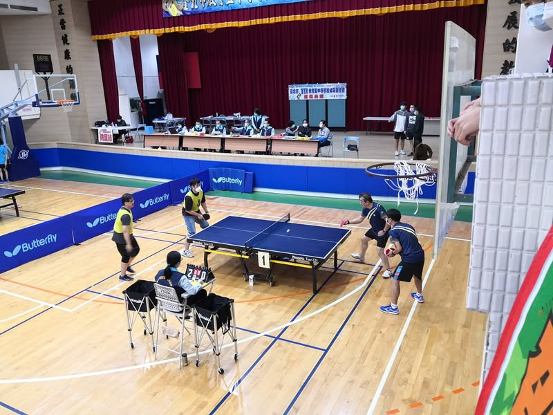
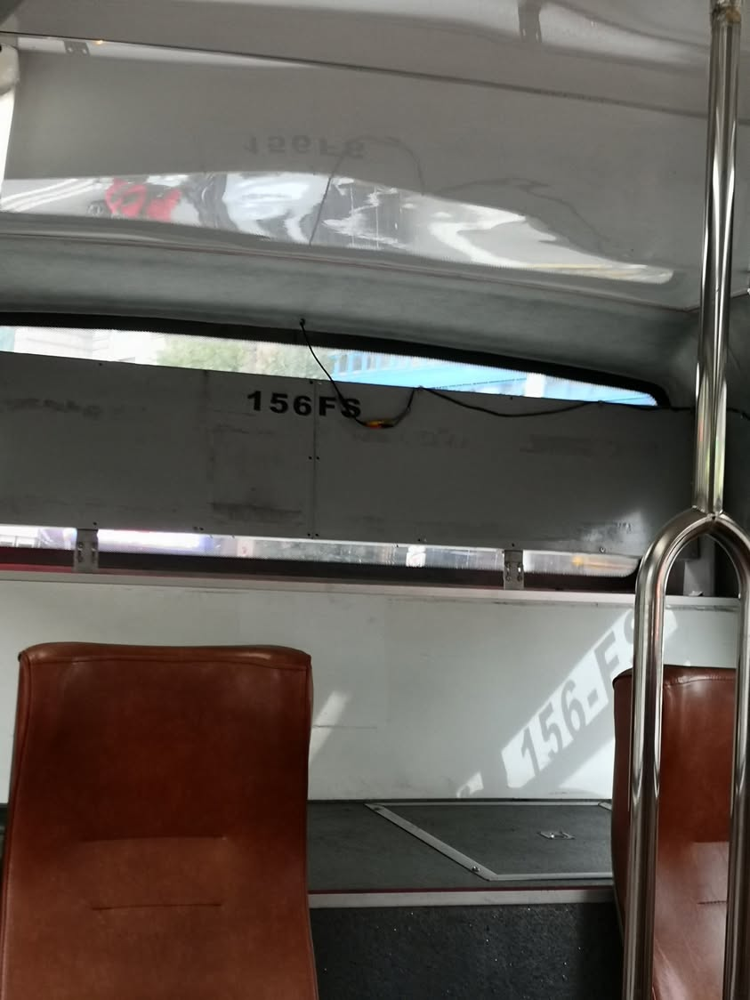

超爛的路線建議

今早7:00從三重要去麗山國中，google map顯示7:10 有一班232可搭博愛路轉乘247，56分鐘即可到達。我在公車站等到7:10，再查一次google map，建議路線竟完全沒有232的選項，我只好採用google map的最新建議，再走去新北大道搭乘617，準備到行天宮轉乘222，但，很不巧的我走出地下道時222剛剛開走，等下一班要再25分鐘。此時google map建議搭乘72到大直國小換乘內湖幹線，就這樣，我終於在8:30抵達麗山國中。

因為匆忙到場，沒有熱身先練球的情況下，直接上場，比賽場地的光線和球桌的彈性都和學校不同，還沒適應的情況下，自己最擅長的切球切不過網，只有反手擰有稍微發揮，沒多久就被對手麗山國中3:0 解決了。

由於學生隊和教師隊同時進行比賽，導致我們的強棒必須在學生隊比賽的時候以教練身分在旁指導而無法參賽，很快的，第二場對私立復興高中的比賽，我們連輸三點，提早結束比賽。今年應該是有史以來最早結束比賽的一次吧！ 我記得以前都還有打到下午。

回程，我搭捷運到南京復興站，要改搭292回三重，出站時看到292剛開走，公車動態資訊顯示下一班292還要等28分鐘，正打算走去南京松江站時，一台292就開過來了，由於292路線是我每天開車上班的路線，我鐵定不會搭錯方向，但我上車後無論用google map還是大台北公車路線或是直接搜尋292路線動態資訊，都查不到我現在搭的這台292。這台車號156-FS的292其實是去程的車號，但司機開的卻是回程的路線，而沿路的公車站牌全都沒有顯示此台292的到站資訊。這證明了什麼呢？證明我們查詢的公車路線恐怕都是假的，公車上大概也沒有裝GPS吧！

