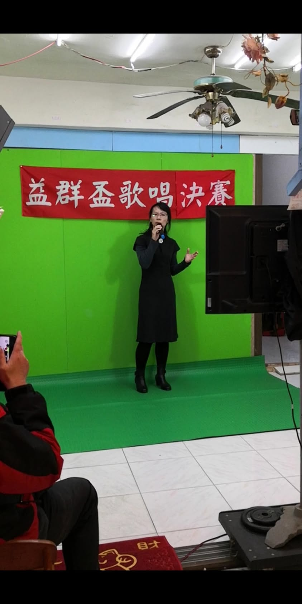
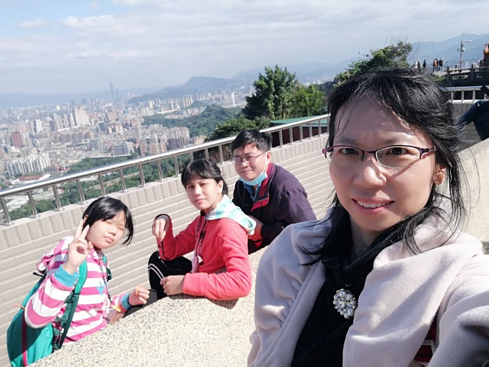
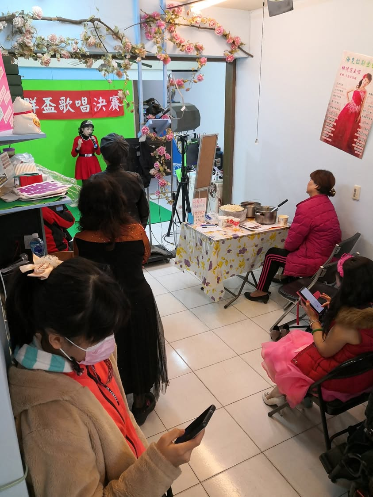
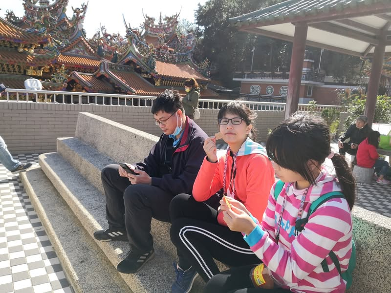
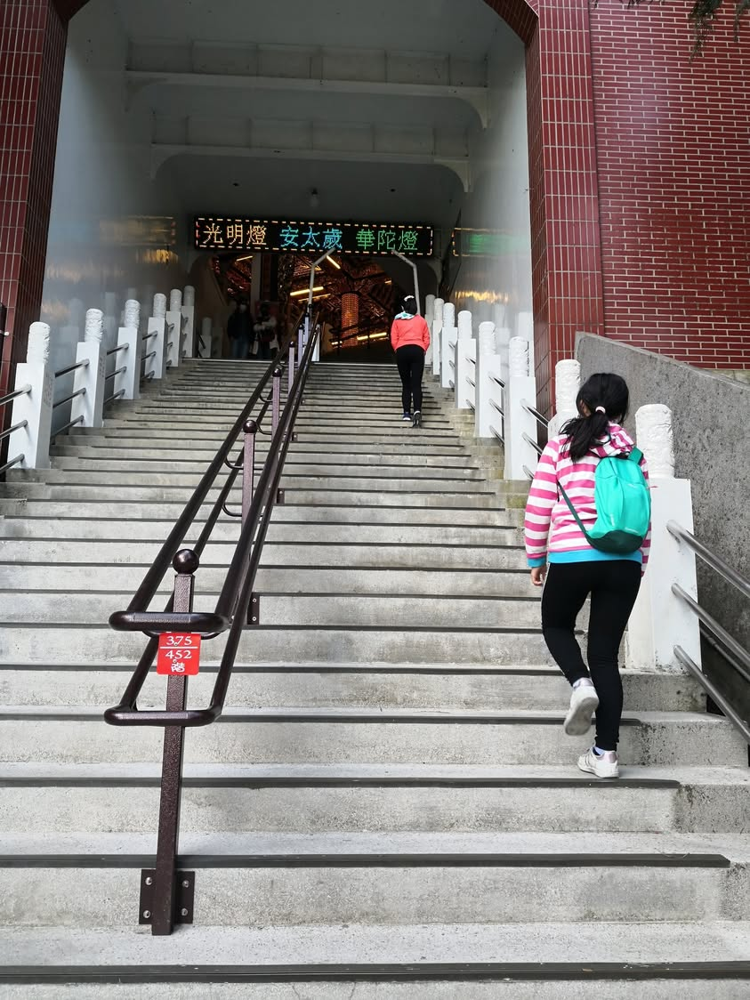
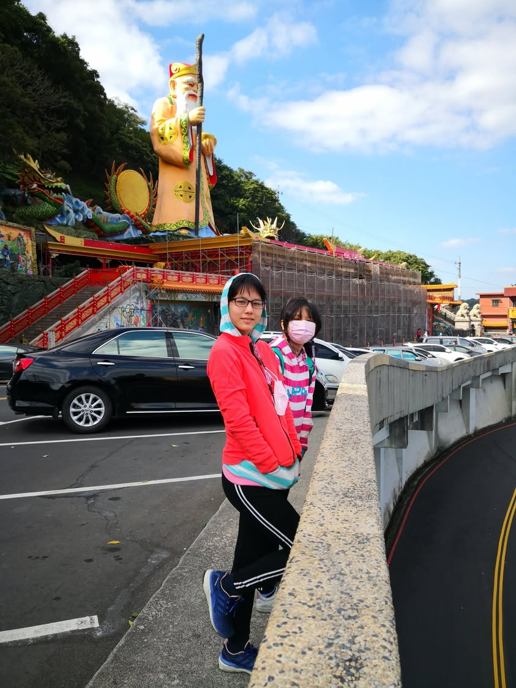

這個假日去參加「益群盃歌唱選拔賽」的決賽，這個歌唱比賽規定只能唱指定曲中的其中一首，所以我練唱了「渥雨」參賽。
今早，全家一起去到中和參賽，攝影棚隱身在菜市場中，攝影棚內全是盛裝打扮的阿公阿嬤，第一次參賽的我和兩寶都算是開了眼界，希望我退休之後也能這麼有活力這麼有衝勁的參加比賽。
決賽前幾天，有多次合唱參賽經驗的小寶提醒我該如何保養喉嚨，今早大寶幫我綁頭髮，老公開車載我去比賽，謝謝家人的配合與幫忙，今天總算完成人生第一次的歌唱比賽了。

比完賽換上球鞋，去中和烘爐地土地公廟走走，眺望臺北盆地，放鬆一下心境。

