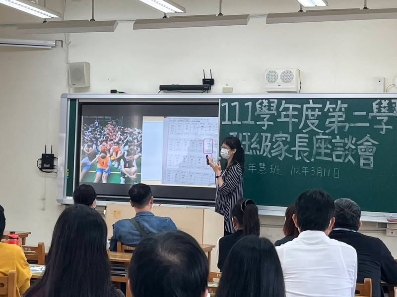
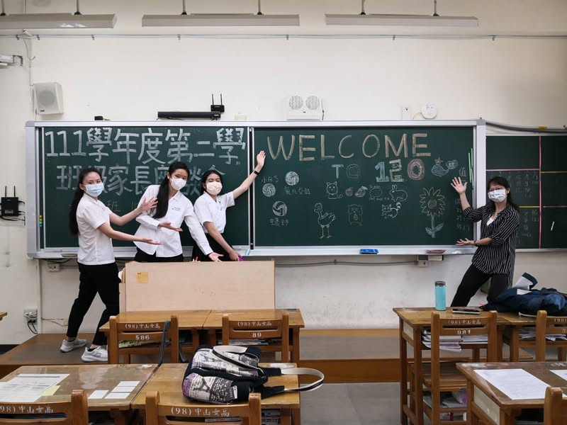
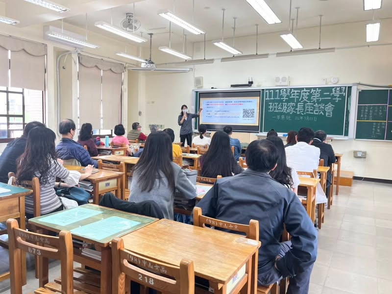

睽違17年再度任高一導師班，高一下學期更是首次遇到完全沒有自己導師班的課，還好上學期透過約談、週記等平日的互動打下良好的基礎，今日9:50開始班級座談會，先是由我做40分鐘的班務報告，之後，是一對一的家長個別問答，到11:50結束，整整兩小時。雖然一對一的溝通比較累，但也更能感受到家長們對孩子的期許，我發現到場的家長們對孩子們的教養觀念似乎都蠻相近的ㄟ，都很開明，都願意退居協助的角色，傾聽孩子的聲音，讓孩子們自己做決定，期望孩子們都能夠努力開發自己的潛能，並成為負責任的好孩子。

