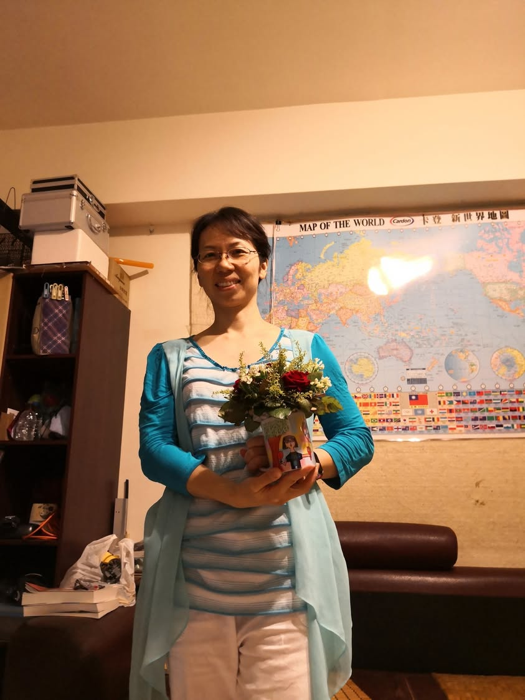
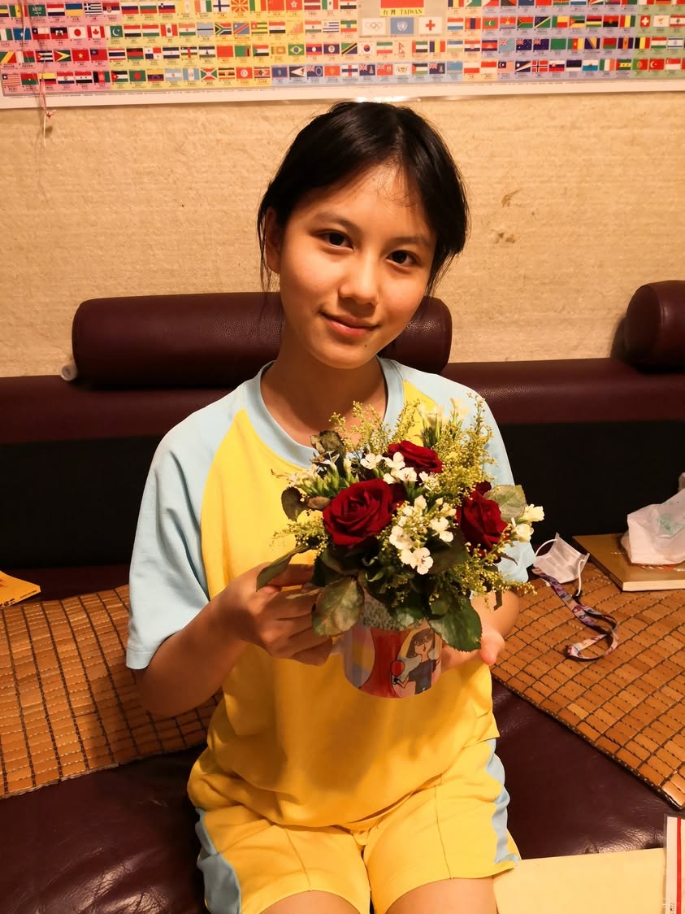

今年不太有當媽媽的感覺，除了早晚接送女兒們上下學之外，平日家事(晾衣服、摺衣服、洗碗、包垃圾)都由兩姐妹輪流做，周末老公負責準備三餐，我就只有假日清理陽台和廚房，偶爾打掃浴室，大部分的時間我都在準備這學期新開的課程講義。 我和女兒們打趣的說，今年母親節換我寫卡片謝謝女兒們今年的照顧好了。 今年敦中八年級的家政作業是將自己設計的圖案轉印在馬克杯上，再插上玫瑰花、深山櫻、麒麟草的花束，這就是大寶今年送給我的母親節禮物。但其實今年我天天都在過母親節。😄😄

