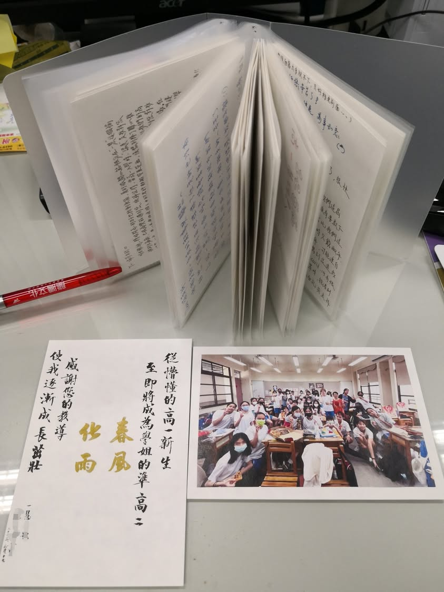
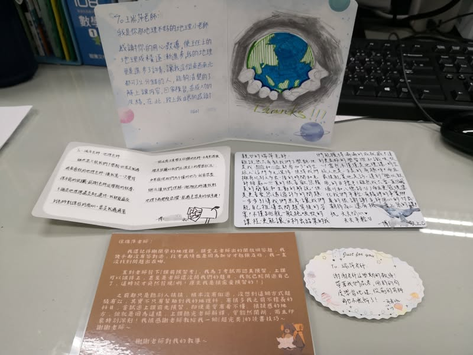

睽違17年才再教高一，雖然忙碌，但其實內心感受是甜美的。有特定幾個非常認真的高一生，下課時間，無論是在該班的講桌前、教室外走廊上、甚至樓梯間、一樓辦公室外，看到我眼睛就亮起來了，輕聲問，老師「現在可以問問題嗎？」然後就急忙進去拿書出來問問題，除非我真的要去開會了，不然我通常都會說好。雖然下課時間被追著問問題就沒有休息的時間會比較累，但好久不見這樣純真可愛的高一生了，已經教學20年的我，學生的問題從不會難倒我了，再次教高一，便可用一種欣賞的角度來享受她們認真問學的模樣了。這一年，我每天都走樓梯去四樓、五樓上課，從上學期爬四樓氣喘吁吁，到下學期輕鬆爬上五樓，真的有練有差，正如學生在卡片裡寫的:「發現您比我們年輕、有精神的事實!!!」
教高一這一年，雖然體能要用到極限，特別是星期二，一整天滿滿的課還外加放學後的Tabata，但吃苦當作吃補，我甘之如飴，享受這樣充滿幹勁的時光，也很開心體能就這樣自然而然的提升了。

