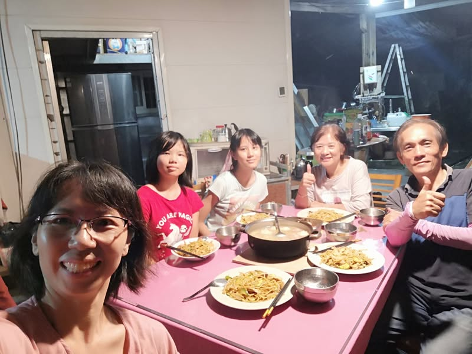
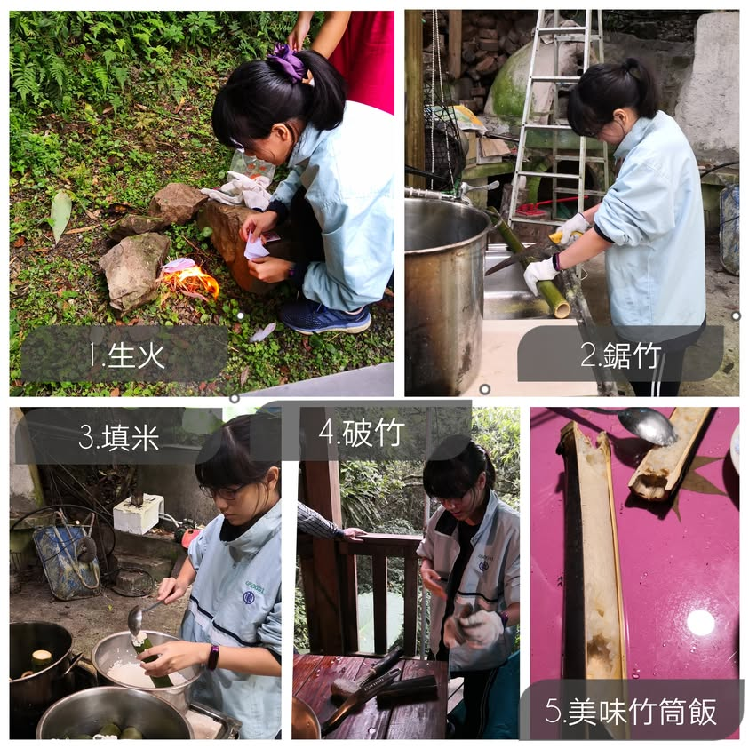
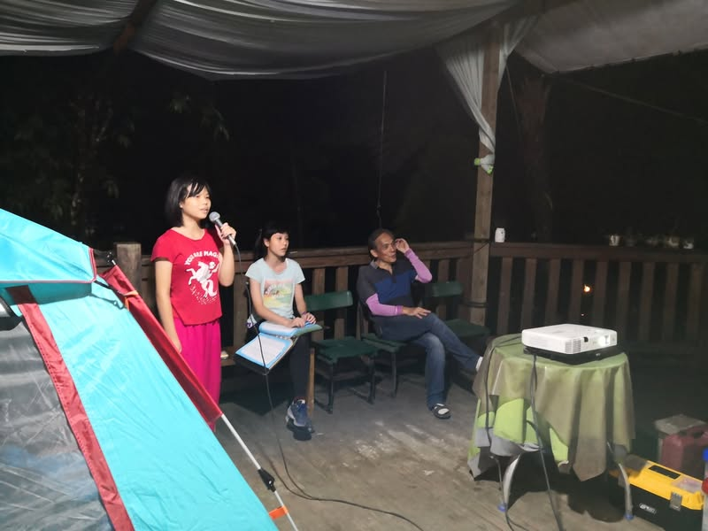
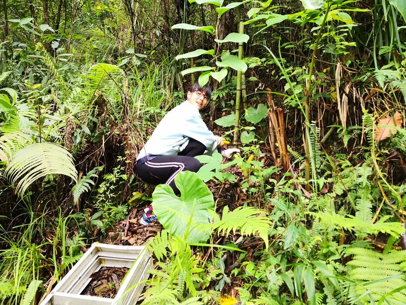
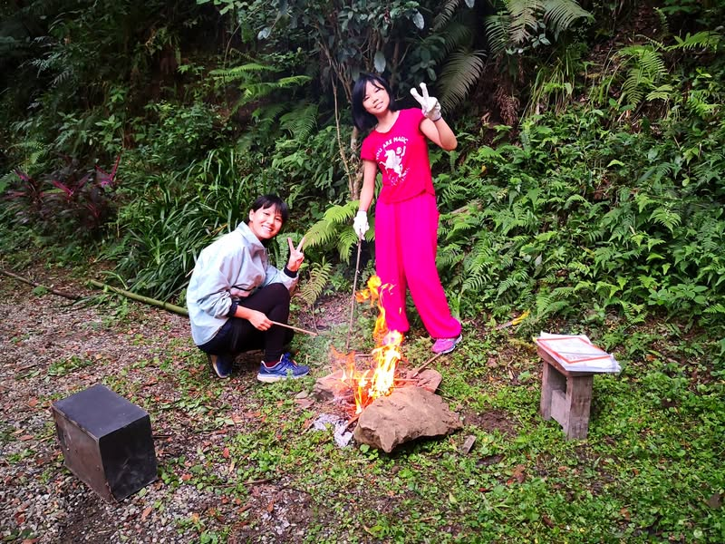
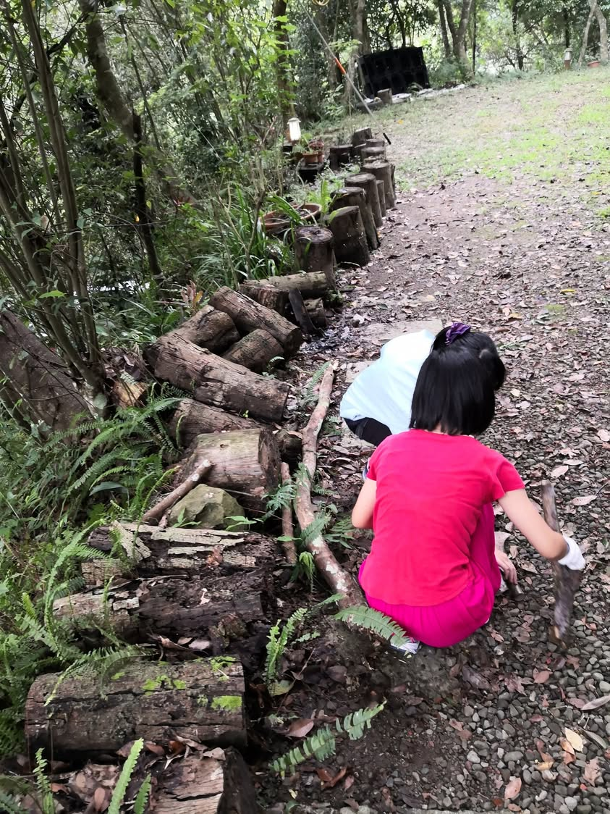
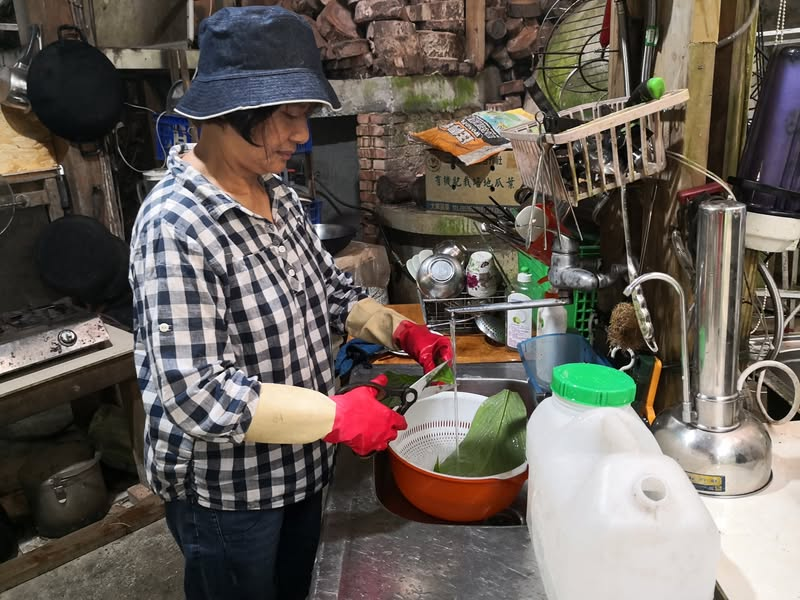
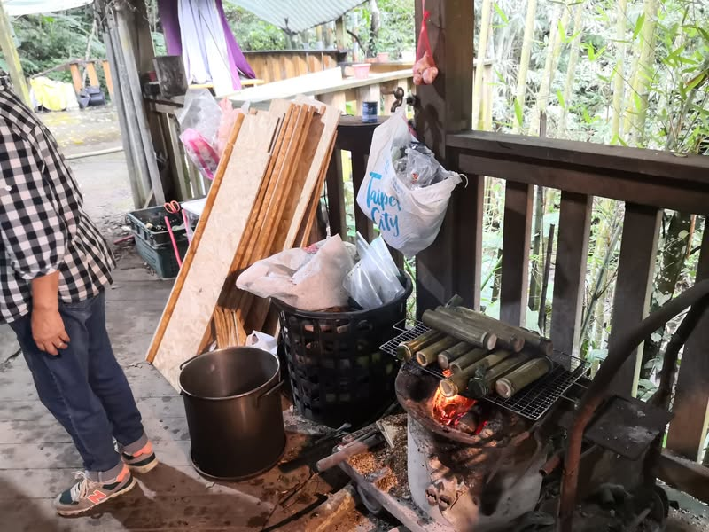
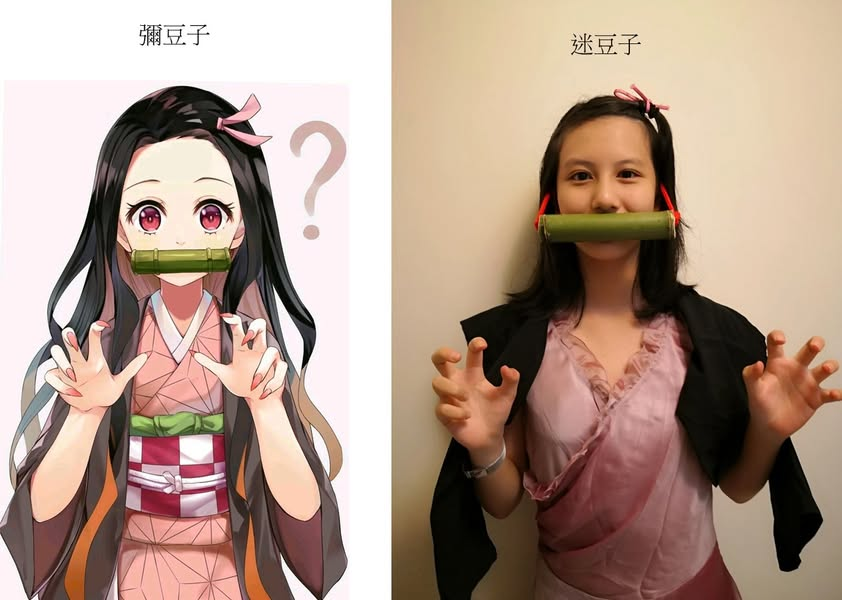

小寶今年上國中，被姊姊力邀進入童軍團，為了讓兩位女童軍能有實實在在的野營能力，商請麥賢山莊借露一宿，距離上一次露營，已經將近三年，此次簡易露營最主要的目標是讓兩寶自己搭帳、收帳、整理內務，練習生火、劈柴、鋸竹、控火。而我則是要挑戰自己做竹筒飯(鋸竹、填米、包裝)，感謝麥姊幫忙燙熟月桃葉和薑黃葉給我當竹筒飯的上蓋，這次因為竹筒裡的水加太多，所以煮成竹筒稀飯了，有勞麥賢夫婦解救，改用直接火烤，勉強算是成功。

竹筒飯完成後，兩寶看上了細竹子，於是兩個鬼滅迷開始心心念念要製作彌豆子嘴上掛著的竹筒，於是兩寶自己去鋸竹子製作，還做了兩個竹杯，用竹杯喝交杯酒，特別香甜呢！

