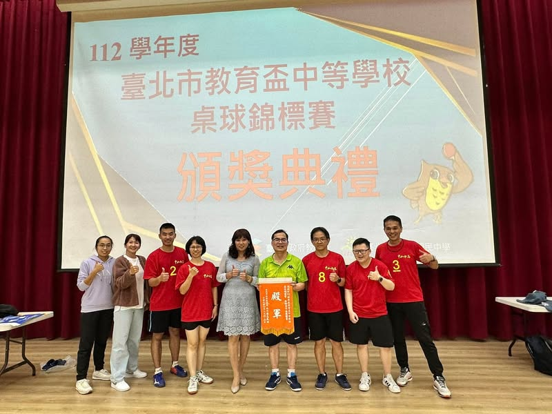

表定賽程從11:40開始，預賽第一場我是第五點，因為隊友已拿下三點，所以我不用上場。下午開始我上場四次，雖然技不如人，注定是砲灰，很快就0:3下場，但，聽說有對到建中最強的那位國手，哈！我這砲灰竟賺到了與國手打球的機會，太榮幸了。他的旋球，真的是左右橫移飄過來的ㄟ，超神奇的！
比賽結束時已經17:30，整天耗在球場，真的蠻累的。

接下來的一年，我要好好練習接發球和進攻，希望明年不再是砲灰。

