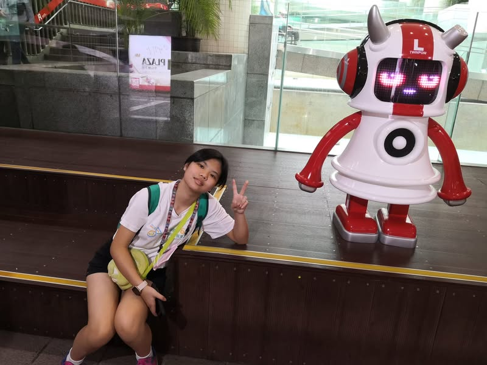

姊姊在家看書備考，我則帶小寶出門閒晃，早上十點帶著小寶到台北市文昌宮幫大寶報名國中會考的祈福法會。之後從雙連站走中山地下街到北車南邊逛書店，買文具，地下街的店家多數未開門營業，走起來有點無趣，唯途中的Plaza有個音響機器人，可以透過藍芽連接播放手機音樂，小寶播放周深的歌，聽到自己偶像的音樂以這樣的方式播放出來，突然就有精神了。
就這樣在陰時有雨的天氣走了12000步。

[影片或檔案](../facebook-media/videos/452457290563311.mp4)

