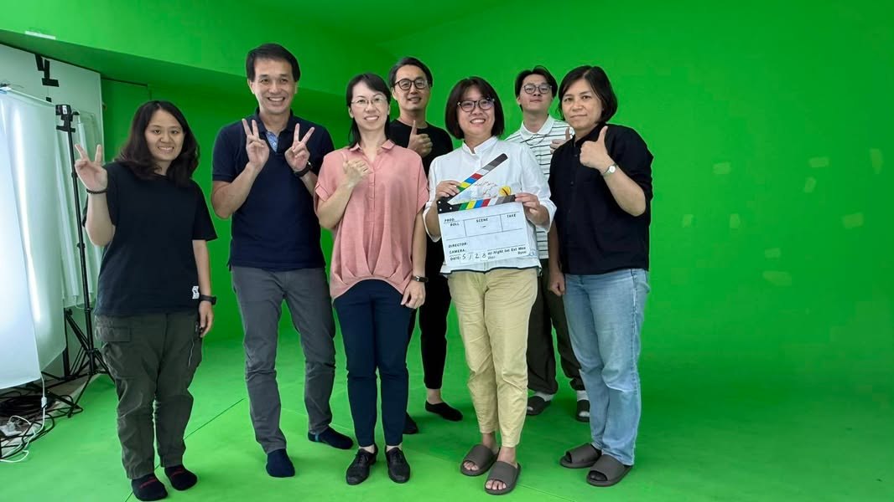
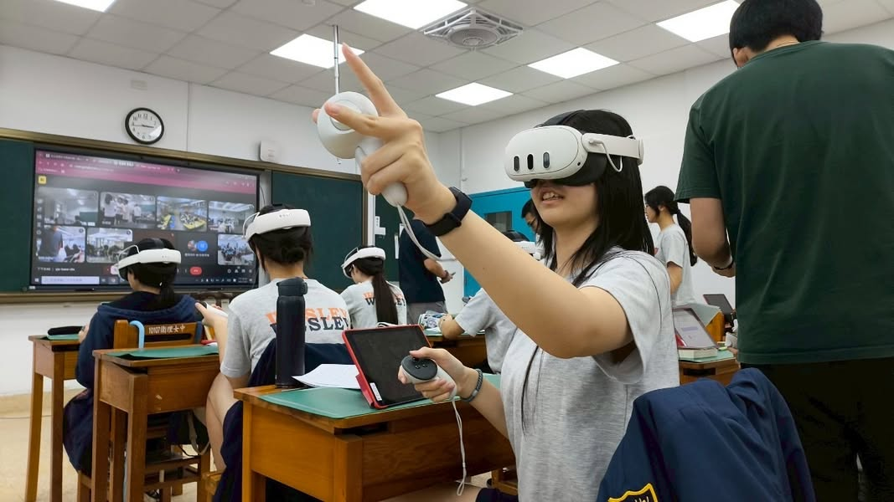
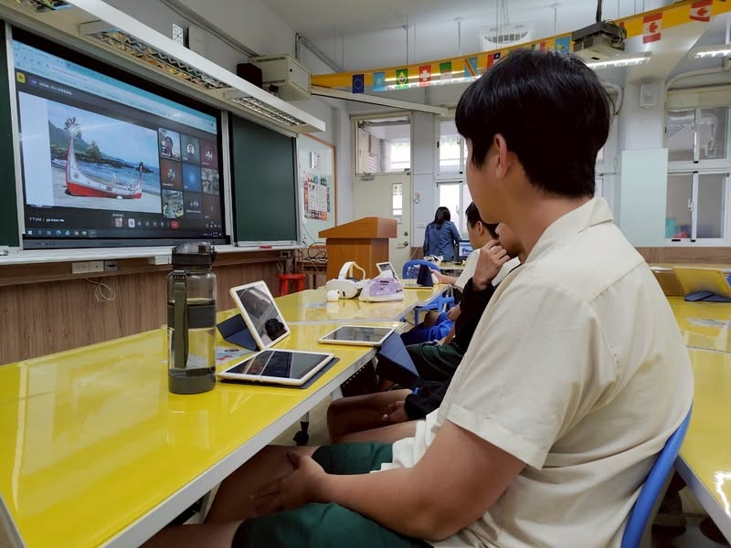
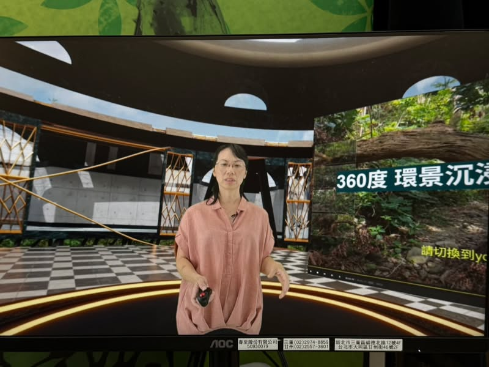
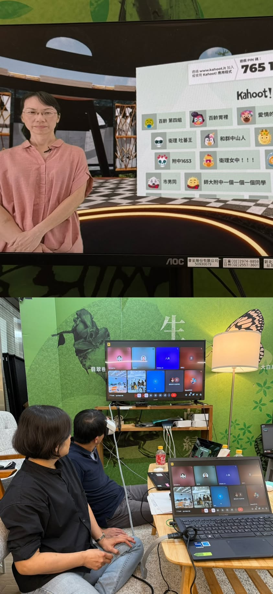

這學期開學初，地理科答應參加一個名為XR共學的實驗計畫，我們以為很好玩就答應了，答應之後才知道並非只是設計一節課的課程那麼簡單而已，過程中要先對收播端學校和教授各說課兩次，每次訪視的教授都不一樣，總共六位，一直開會，一直報告，還要針對建議修改。

5/28直播那天，早上上完兩節課後，10:45就出發去攝影棚，除了順流程、彩排還要線上說課、公開觀課、議課，直到5:50才回到學校。回到學校再走去參加謝師宴。
這天雖然忙碌，但是因為有許多的新體驗，感覺很有趣。

PS. 蒐集到來自收播端的回饋與照片後，再補發此文。

下方是直播連結，影片可以360度滑動，也可以調解析度到4k,但用youtube看不出來，要用3D頭盔才會感受超立體和清晰的感覺。
https://www.youtube.com/watch?v=T8Qz0RRS4kA&list=WL

