7月5日大地震的預言沸沸揚揚，本想安排出國旅遊，但家人們都因為天氣炎熱而興趣缺缺。
7月1日放暑假時，我問大寶，要不然我們去露營，如果大地震發生，至少我們在空曠的地方不會被建築物壓傷。大寶答應了，接下就要想一個安全的露營地點，暑假每天都37度的高溫，平地超級酷熱，但是高山上萬一真的大地震可能就會山崩阻斷交通，最後我們選擇了桃園台地中壢區埤塘旁的水樂活親子農場，至少在空曠的埤塘旁邊應該不會像城市內那麼燜熱吧！
因為老公和小寶完全不信預言，更不想在大熱天露營，所以此次出遊，只有我和大寶，參加過童軍團的大寶是超級好幫手，我們兩人的桃園地景之旅就從7月4日下午開始囉！

7月4日 

下午3點 天氣轉陰，我開車沿著省道1號跟大寶介紹沿途都市土地利用的景觀變化，下午4點半抵達虎頭山環保公園，遠眺桃園台地，多雲時晴微風陣陣的天氣好舒服呀！
下午六點 到同事推薦的艾隆義式美食吃晚餐，附近逛逛後，大約七點半抵達營地，天色已暗，不過營地有燈還看得到，好久沒露營了，這次帶的秒開速搭帳，很快就搭好了，只有調整外帳和內帳與帆布地墊比較需要花時間，老公的工具箱裡面工具齊全，讓簡單的帳篷也能有前庭後院，能遮陽也能晾衣，搭完後成就感滿滿，甚是滿意。

7月5日 多雲時晴

早上 七點我沿著埤塘的環湖步道走一圈，觀察埤塘與周圍水稻田的關係。
早上 九點半到大有梯田生態公園的森林挑戰區玩有很有挑戰性的遊戲器材，從第一關的蜻蜓點水到最後第九觀的直上雲霄，其中需要靠臂力的單槓系列我沒辦法，其他手腳協調的部分我都能勝任，自己踩腳踏車拉回纜車座椅再溜下去的大小滑索超好玩，上午，人不多，不用排隊，超推薦。

上午11點 去林蔭超多的虎頭山公園走步道，午餐吃錢都涮涮鍋，用餐結束大約三點，此時天空有點轉晴了，有點變熱了，不想在大太陽下遊玩，因此拉車到海邊的觀音藻礁生態環境教室，16點抵達，小小一間解說室我們也硬是混到17點生態教室打烊，但我們也有認真學習藻礁的相關知識啦！
17點多抵達草漯沙丘地質公園，體驗夕陽、大沙丘、風車和沙灘的美景。海邊的風真的比較大，但也很涼，向來都唉體力不好的大寶看到前方的大沙丘就興奮地嚷嚷著要爬上去，然後就一路爬上爬下翻過3座沙丘，直奔沙灘去踏浪了。爬上大約15公尺的大沙丘再從沙丘陡坡走下來，小腿會陷入沙丘步行較費力，但大寶玩得不亦樂乎，爬上爬下，跑來跑去超開心，像這樣在體驗大自然的過程的運動是我最想要帶給孩子的活動，在親近自然的過程中自然眼觀四面、耳聽八方、手腳並用，而從地景觀察與體驗而來的知識絕對比教科書中那一張照片來的全面又深刻。

7月6日 清晨陽光露臉，前晚洗晾的衣服也都乾了，七點半叫大寶起床吃早餐，9點收完帳篷，到附近的崙坪文化地景公園走走，那邊有森林停車場，園內有許多的榕樹和樟樹，林蔭算多，逛到11點就開車到青埔高鐵周邊繞繞，讓大寶觀察高鐵站周邊的發展脈絡，之後就前往大江購物中心吃午餐，逛到下午2點就啟程回三重！

在熱帶性低氣壓轉變為中颱丹娜絲沿著台灣海峽北上的過程中，我們很幸運的在盛夏中的三天兩夜桃園台地露營之旅，幾乎都是多雲時晴的舒爽天氣，唯一有遇到大太陽感覺熱的時候只有7月5日的下午3點到6點，7月6日下午回到三重也都只是陰天，沒有下雨，而在此同時，中部的縣市傍晚就已經停班課了，感謝天公作美，讓我們在颱風侵台前的涼爽天氣中，完成了這次完美的三天兩夜桃園地景之旅。

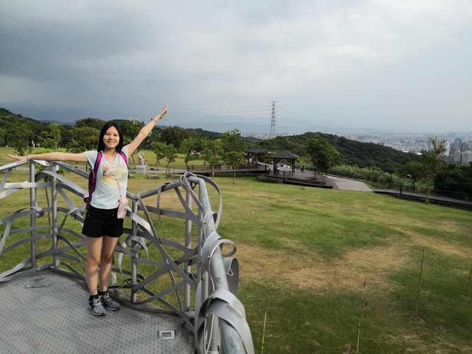
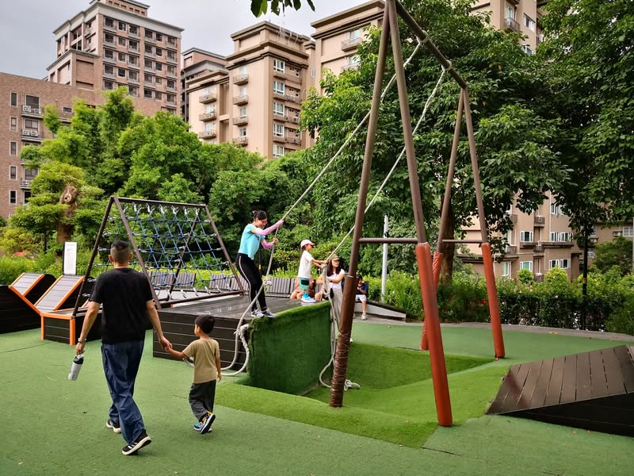
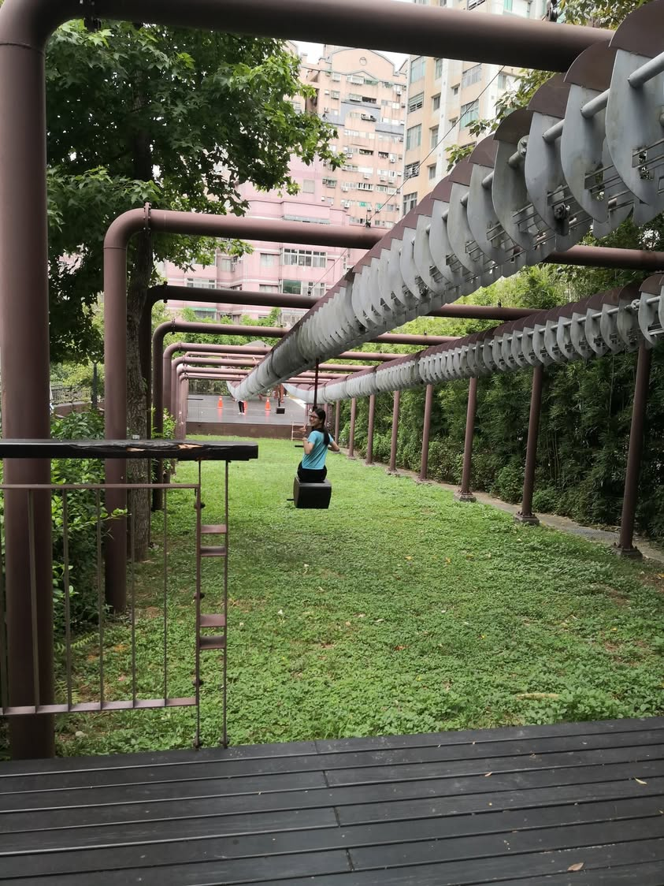
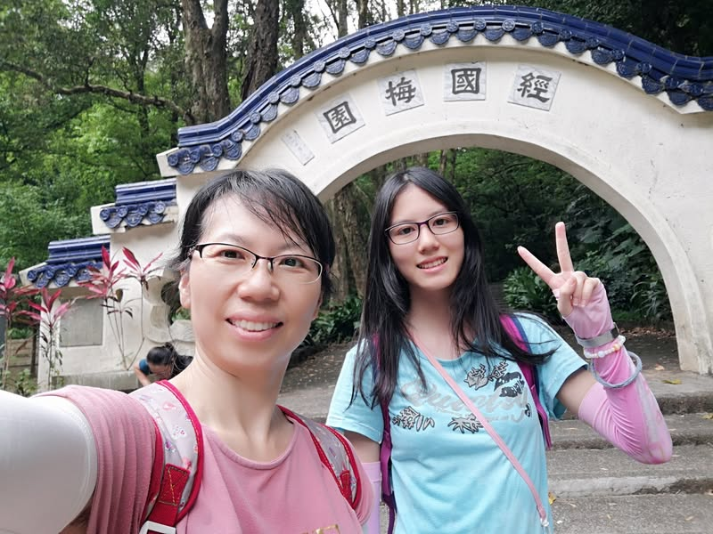
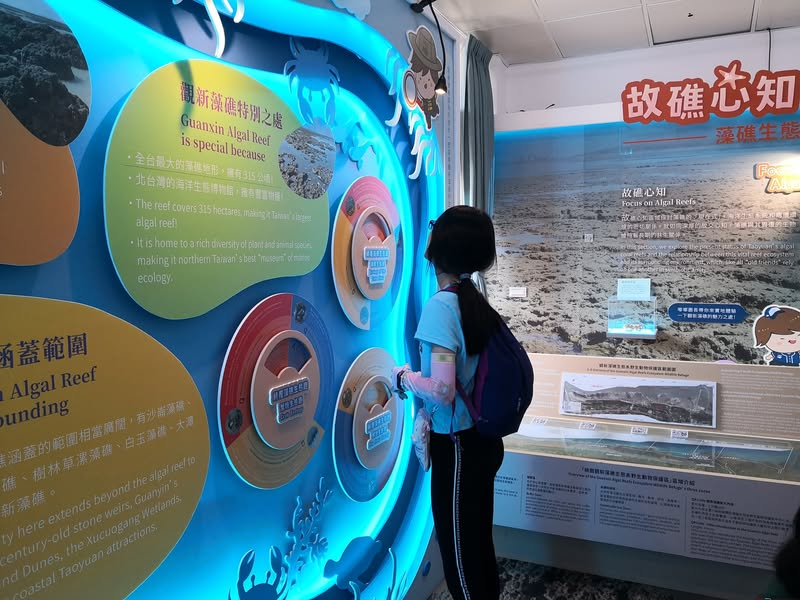
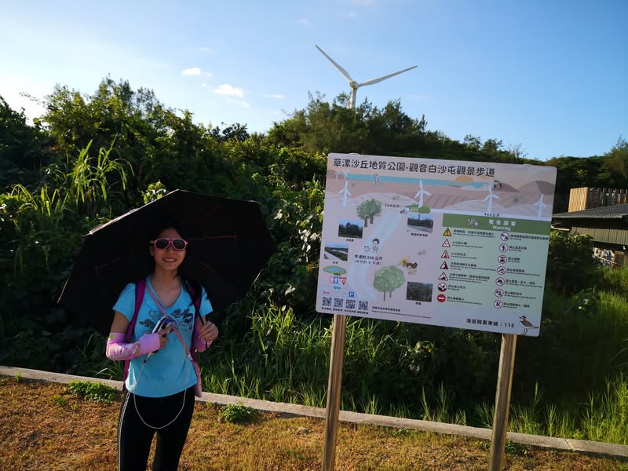
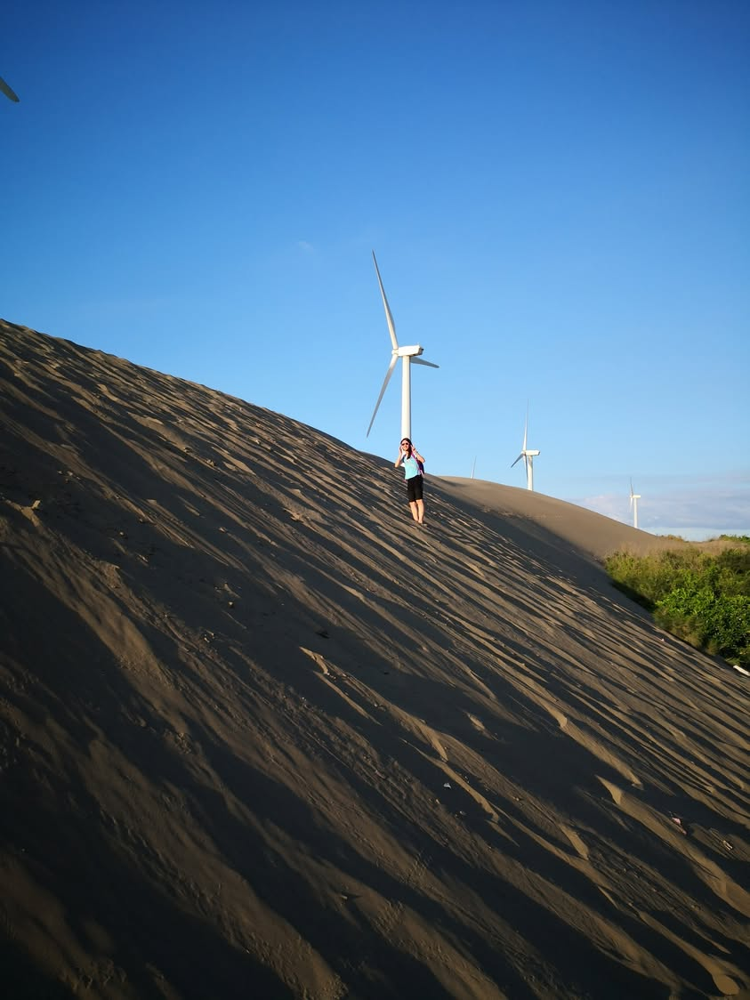
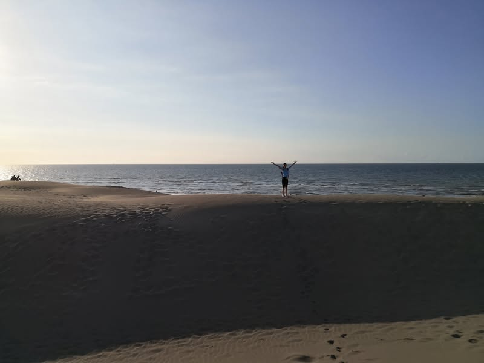
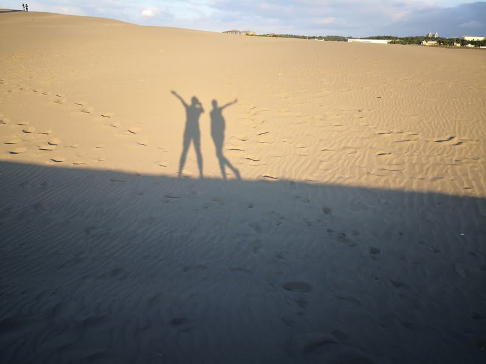
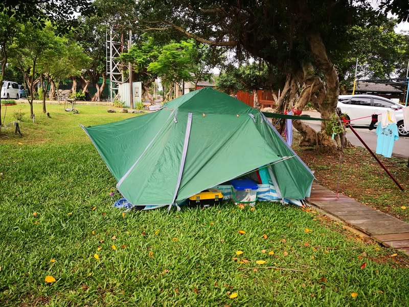
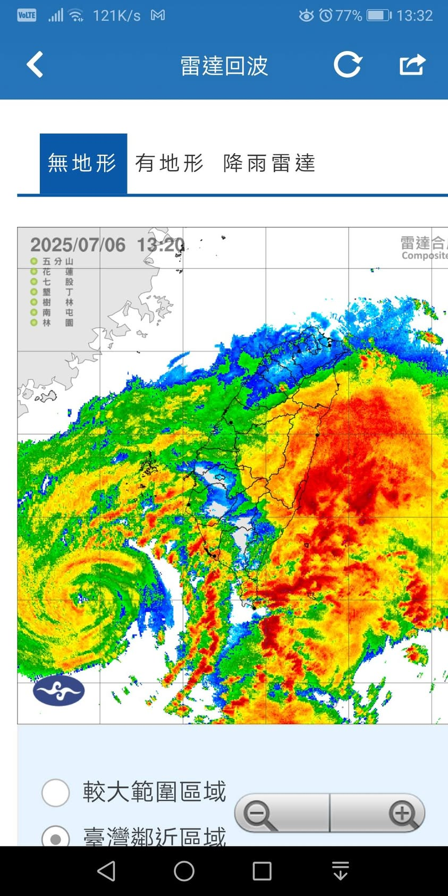
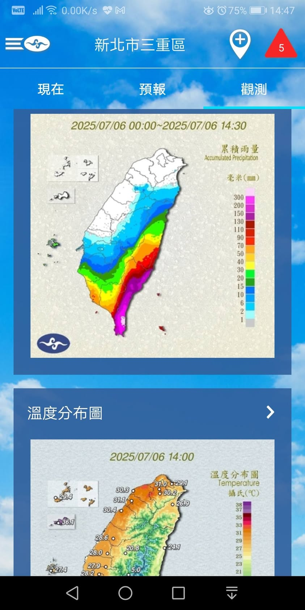
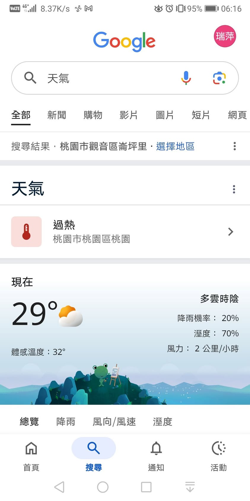
[影片或檔案](../facebook-media/videos/1490441929033417.mp4)

