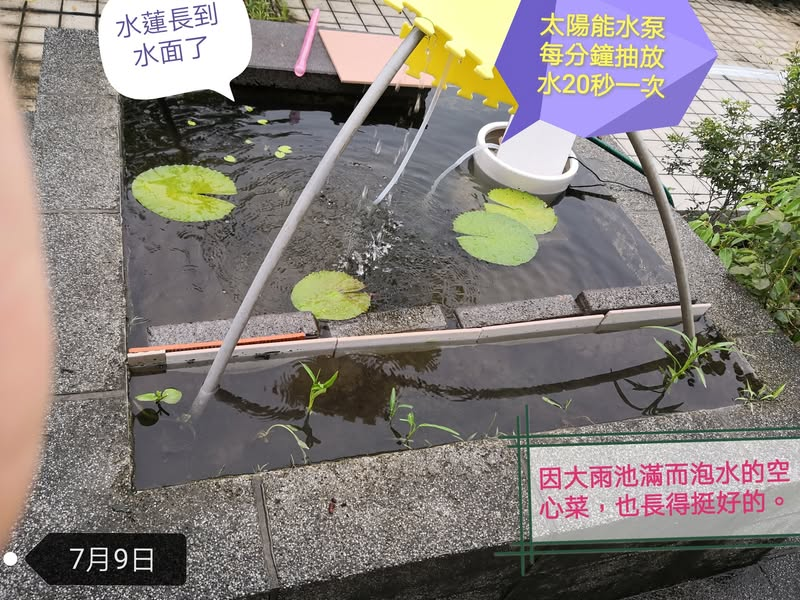
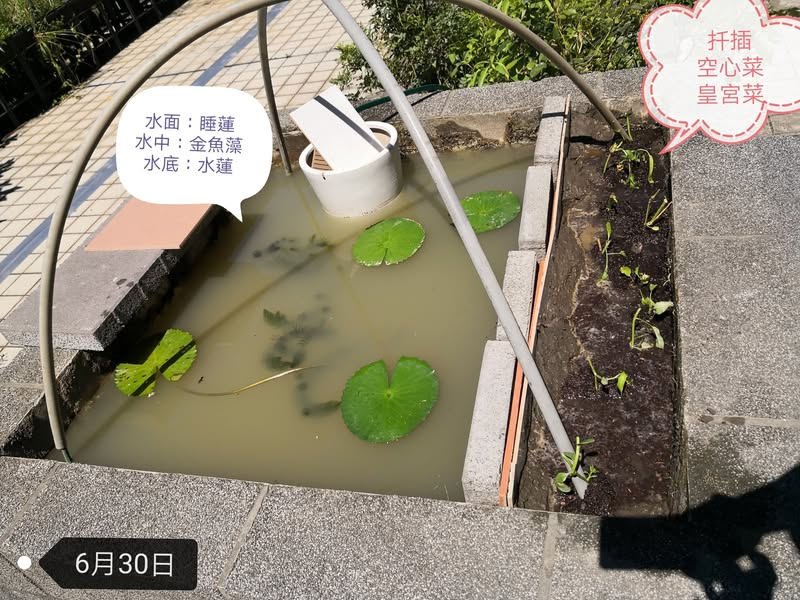
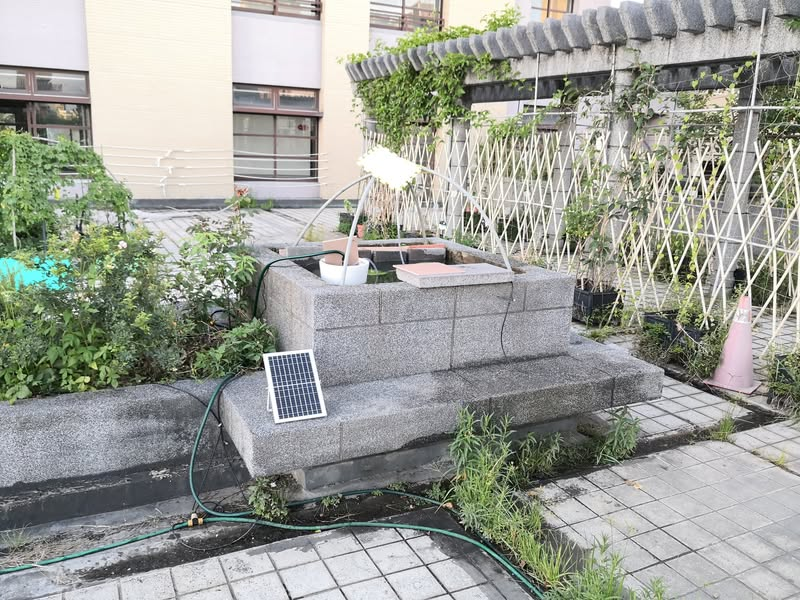

小田園的魚菜共生池成功了！😃😃
6月28日
從學校生態池移植一株睡蓮和金魚藻，家裡煮菜切下的水蓮根部也插到底泥中。
旁邊土耕區補土至補水位，讓土耕區在正常情況下不會泡著水，再扦插空心菜和皇宮菜。
6月30日
黑水管以虹吸原理放濁水，水位控制器自動補水
7月1日 池水清澈後，加裝太陽能抽水泵，營造池水內循環。棚架頂部綁兩片巧拼，幫水管遮陽。
7月2日~5日 每日37度的高溫與大風，本以為巧拼會被大風吹壞，空心菜還沒生根就被曬乾。

過了一週後再回學校看，7月8日~9日 熱帶性低壓的降雨，補滿池水，水蓮，睡蓮，空心菜就算泡水也活得好好的，這樣我就可以安心放暑假啦！

[影片或檔案](../facebook-media/videos/769158755545399.mp4)

