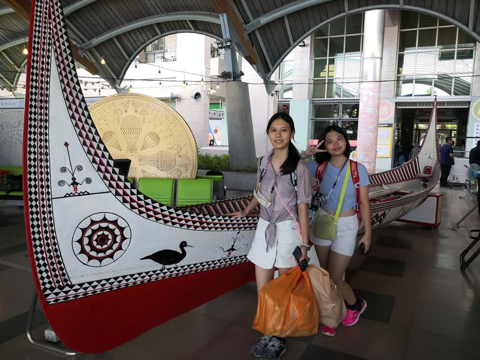
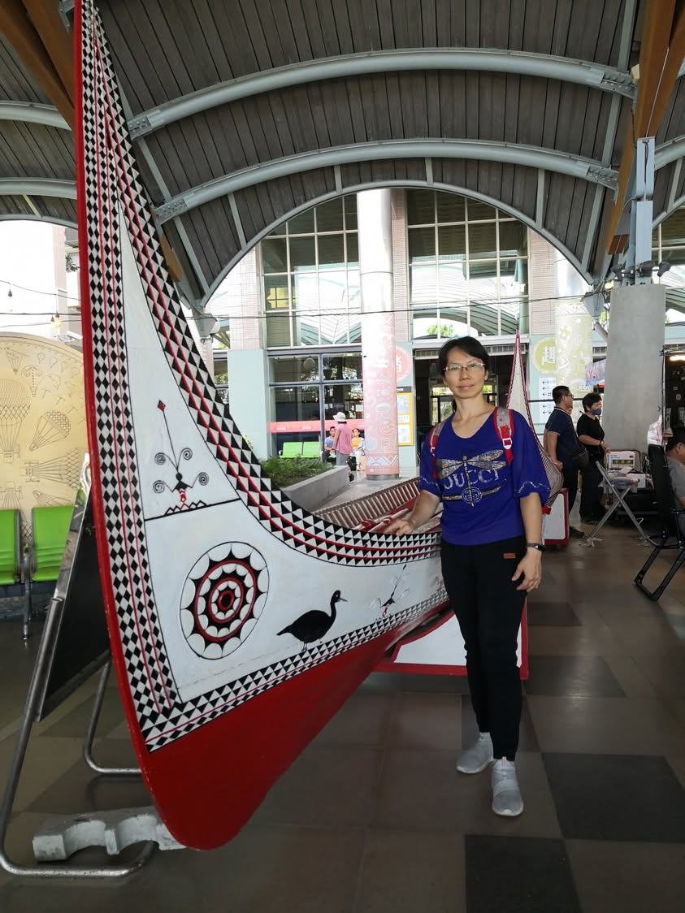

今年六月上過蘭嶼拼板舟的XR課程後，這次回台東再次看到在台東車站的拼板舟，親手觸摸拼板舟上的雕刻紋路，這真實的觸感是3D課程無法辦到的。科技進步雖然可以讓我們身歷其境，但仍舊無法取代實地走訪，畢竟，唯有自己摸到，看到，吃到，聞到的，才是最真實的體驗。
這次回台東也有吃到麵包果（巴吉魯）加小魚乾煮的湯，麵包果的種子吃起來像燉花生，但還是不一樣，無論怎麼形容都比不上自己親自品嚐的感受來的深刻呀！

