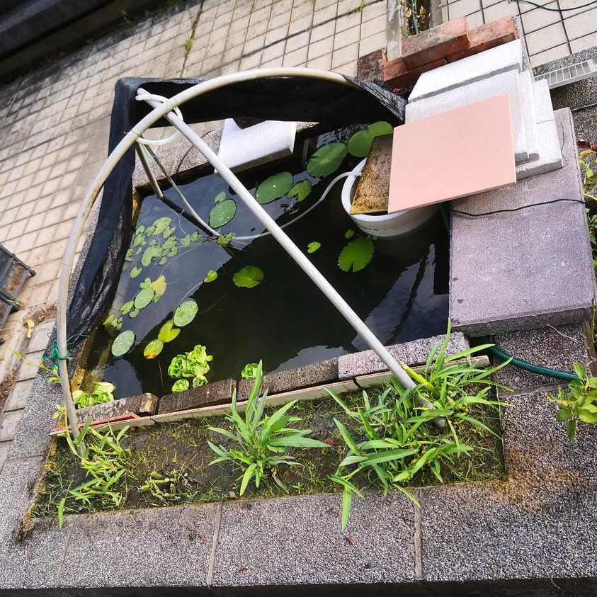
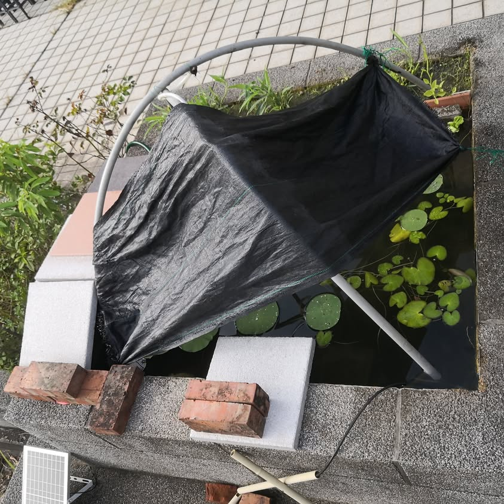
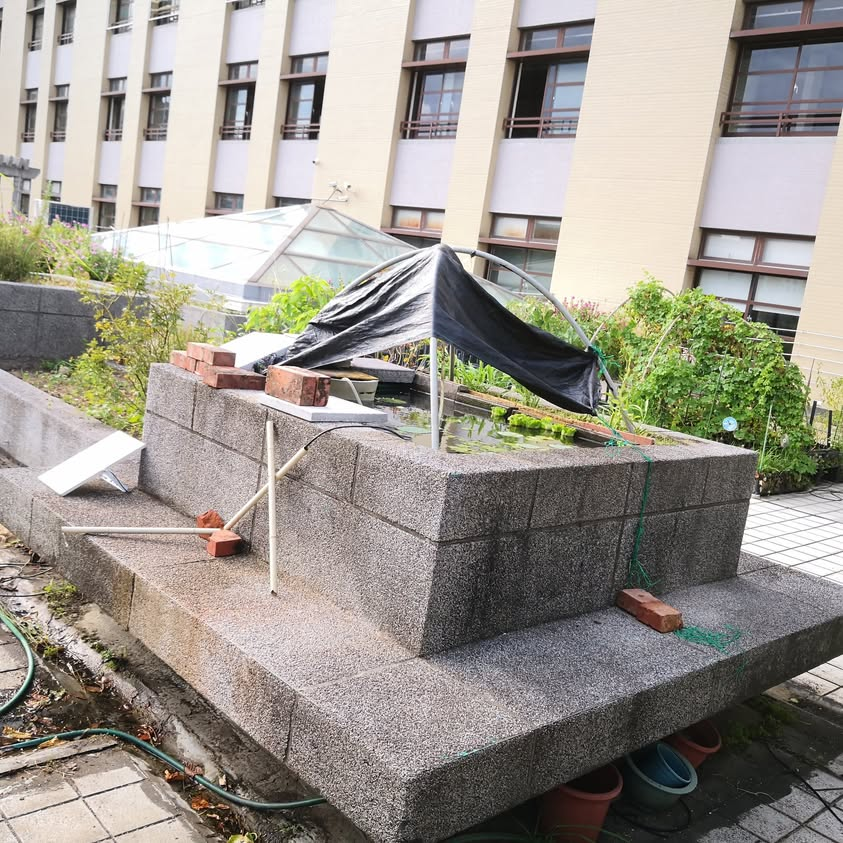
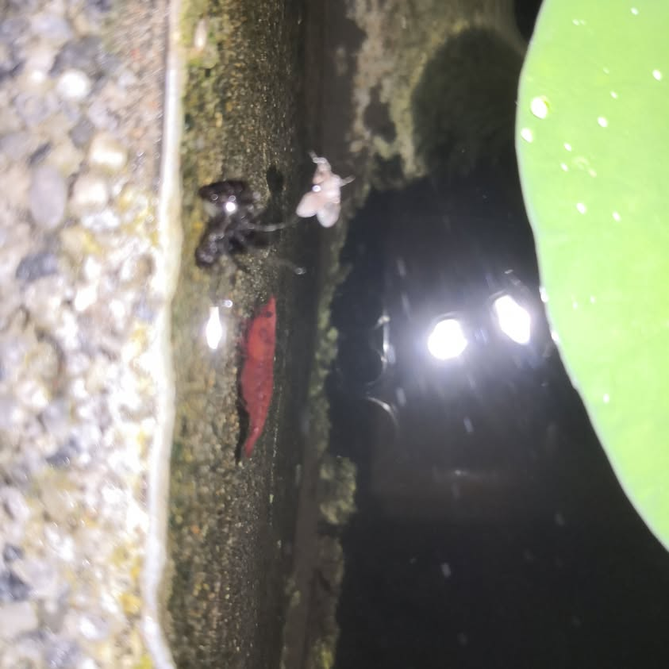
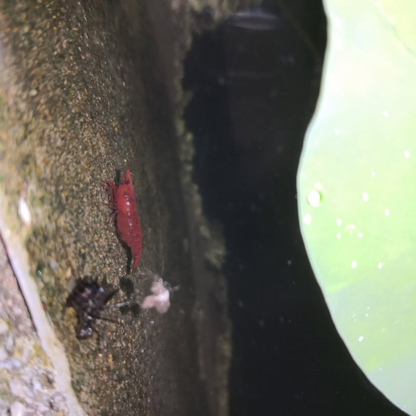

今天天熱風又大，遮陽用的大巧拼墊被吹掉，早上九點改用黑塑膠布擋在南面，下午兩點半去看，又被吹翻，只好先丟一小塊從冷凍庫拿出來的保冷劑，就先去上課，3點下課去看，保冷劑已經完全解凍還微溫呢！不過池水不燙，還好還好，趕緊加固遮陽黑布，並用水槍把池子附近沖洗乾淨(順便降溫)，水槍噴出來的水一開始是燙的，看來自動補水不適合在大熱天進行， 因為這樣補進來的水反而會是燙水。
結論：平常水龍頭還是關起來，不要自動補水比較好。

