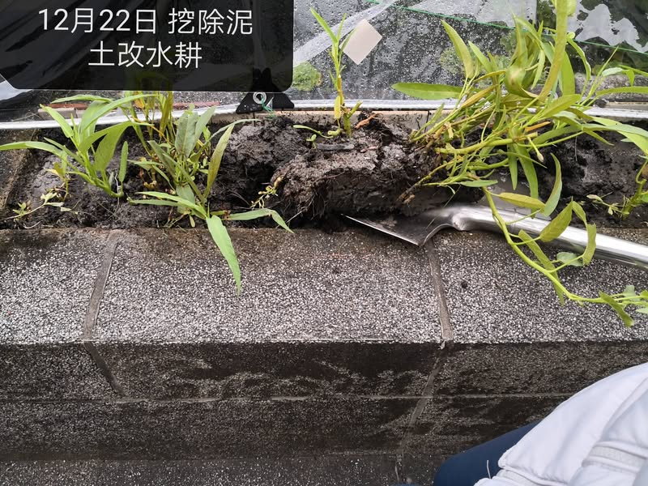
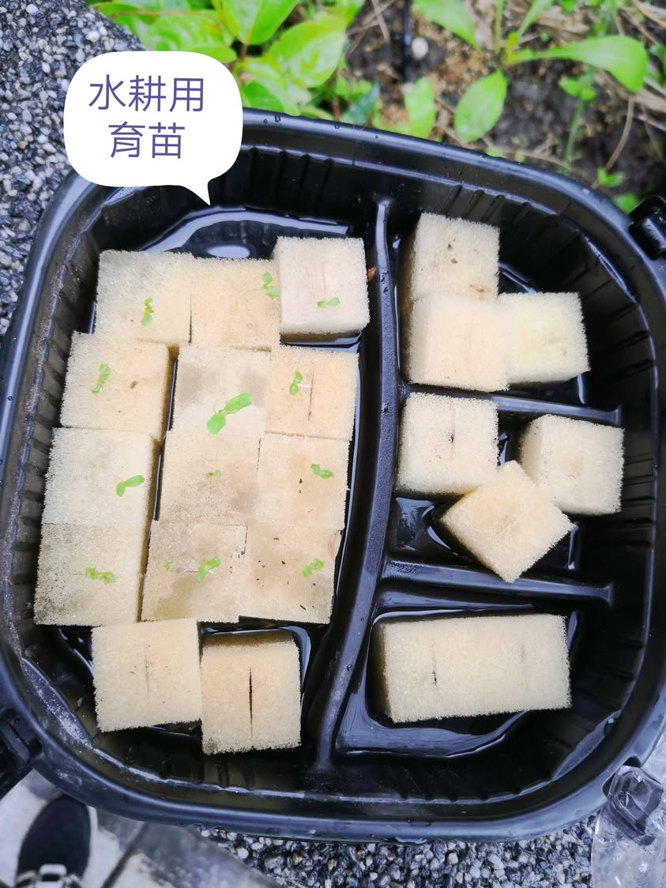
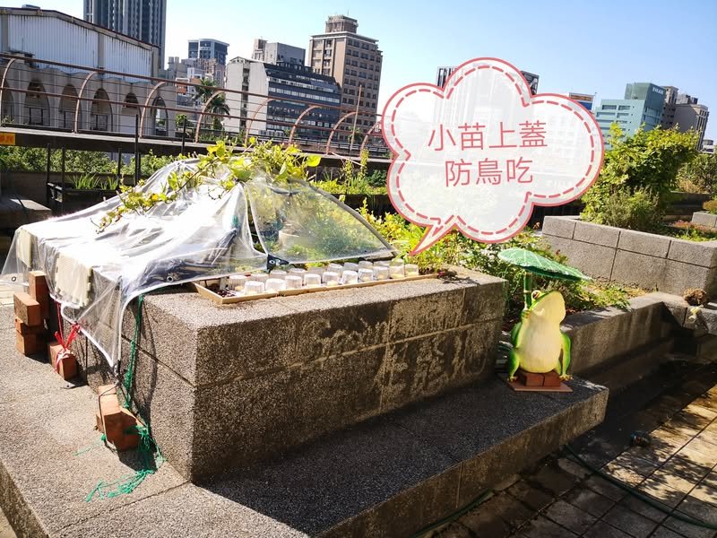
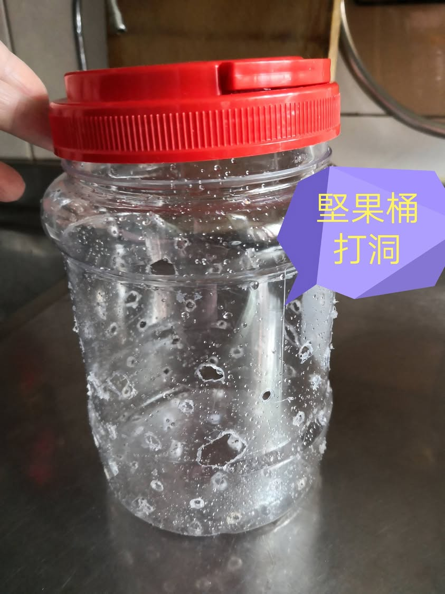
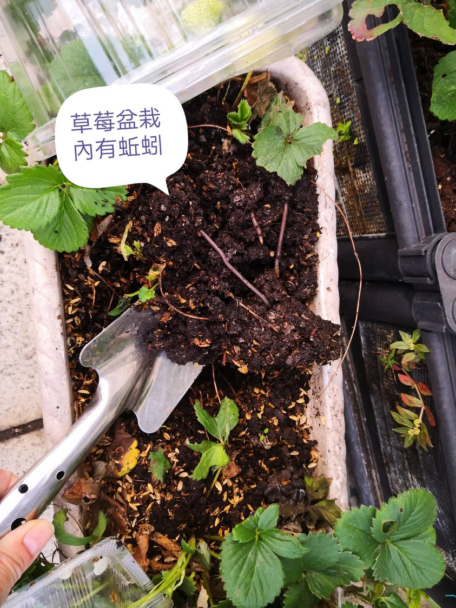
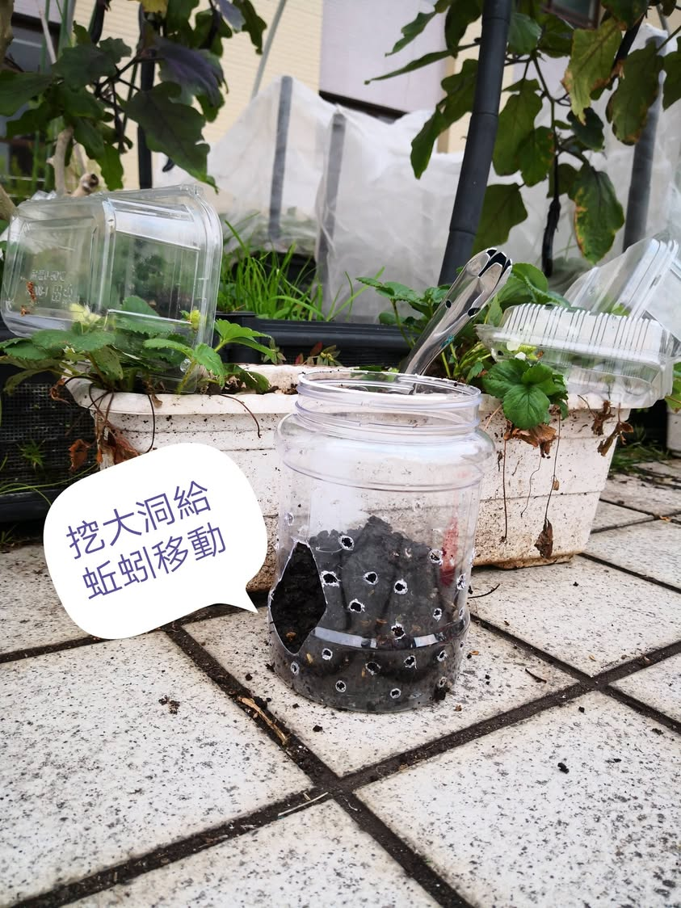
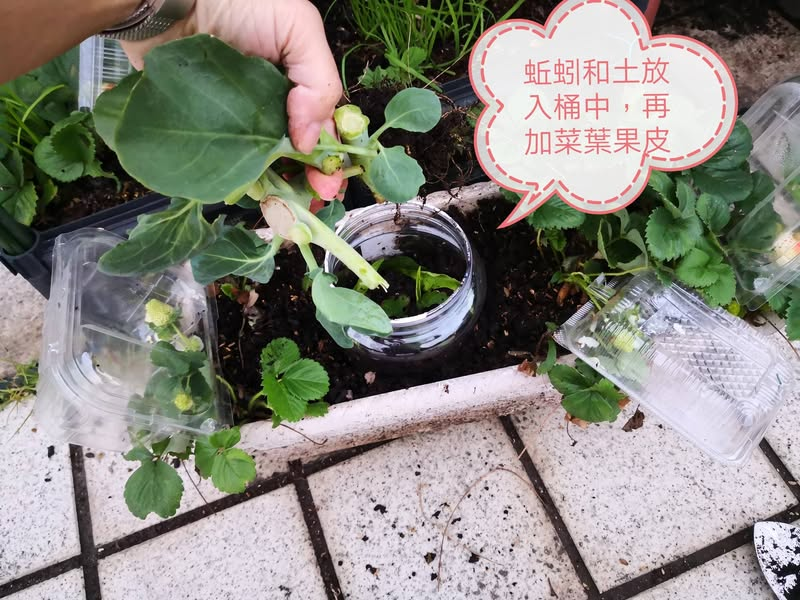

簡易版魚蚓菜共生

之前的土耕區因為水沒有流動，底泥有臭味，12月底挖除大部分泥土，放入發泡煉石，試行水耕。
1月中調整內循環的出水位置，讓水耕區的水逆時針流回生態池。
變成活水之後的水耕區，小菜苗幾乎不太長大，推論可能肥份不足，今日著手設置蚯蚓堆肥盆栽於水耕區的放水口，將菜葉果皮放入堆肥桶給蚯蚓吃，流到底盤的堆肥水再流入水耕區提供水耕菜養分。

[影片或檔案](../facebook-media/videos/1514948292926385.mp4)

