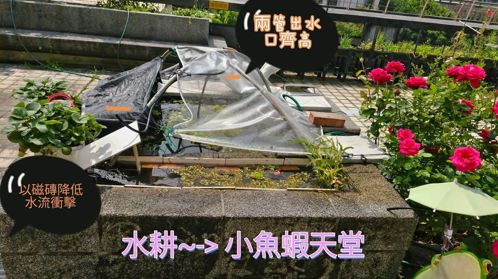

水耕空心菜的旁的小水窪常見的小魚蝦，今早把發泡煉石移除，發現水耕池內有許多小魚蝦，因為大池內的水草眾多，水耕區養分不足，放棄水耕改為小魚蝦的生活池，未來大池就可以養蓋斑鬥魚囉！

[影片或檔案](../facebook-media/videos/913001591519517.mp4)
[影片或檔案](../facebook-media/videos/1210062844542830.mp4)

