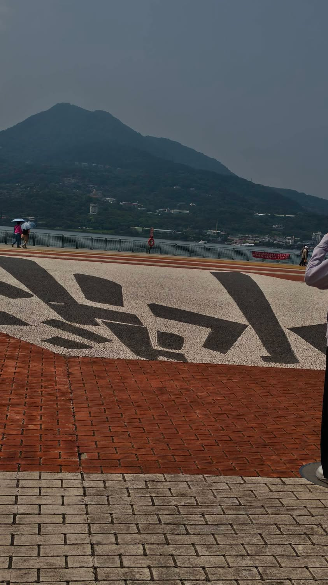
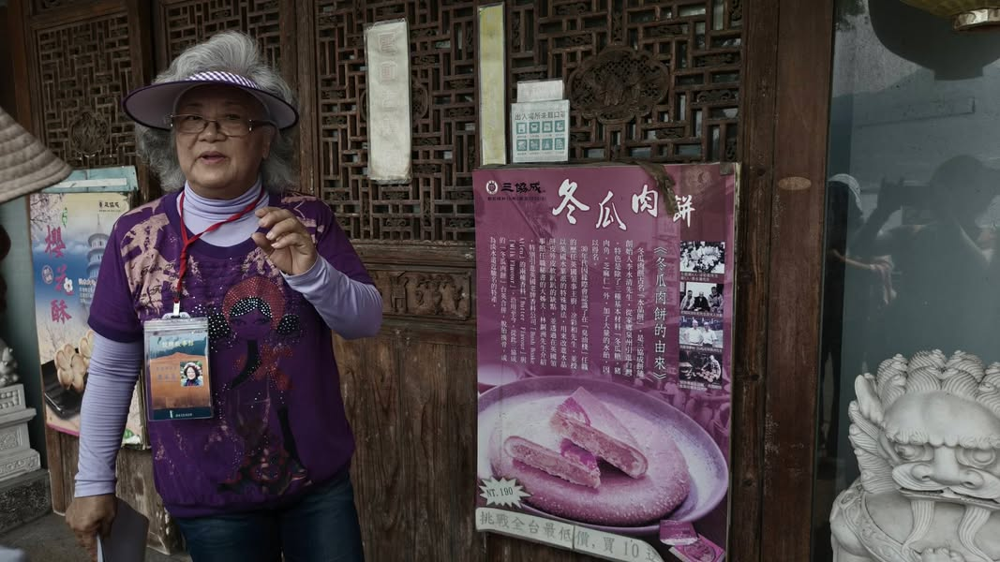
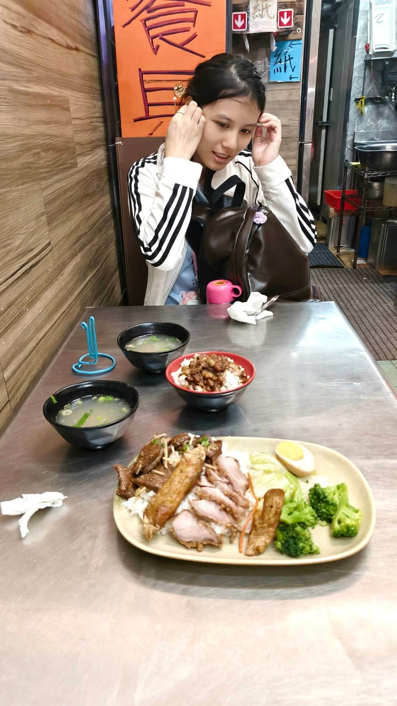
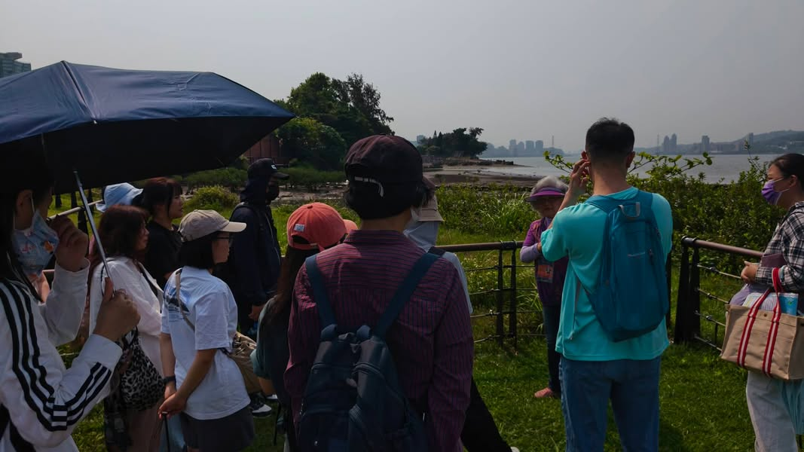
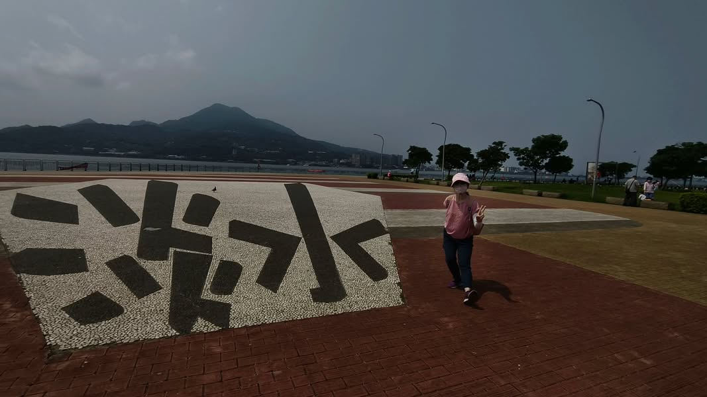
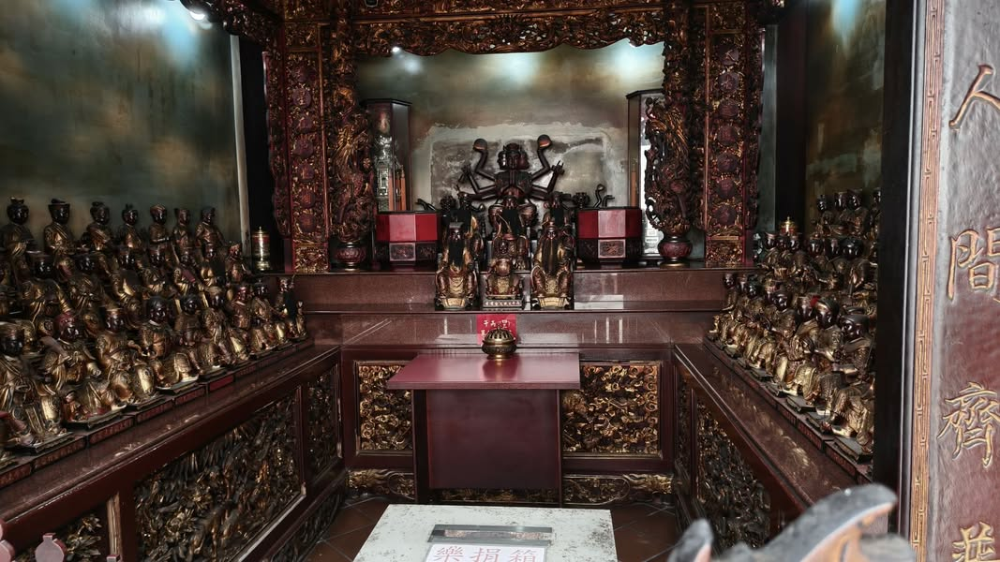

今天帶著大寶一起參加淡水金色水岸的走讀，天氣有點熱，但還好風是涼的，走起來還算舒服。
參加走讀活動，跟著導覽老師認識淡水，可以知道許多在地的小故事，以後再到淡水玩，就不會走馬看花了。

導覽結束，正是午餐時間，到底要吃什麼呢?逛了一下河岸邊的商店，不乏寫著[僅此一家、20年老店、42年老店之類的店]，但，若聽完導覽老師的介紹便知，真正的淡水老街是在半山腰，河邊是最慢發展起來的地方，怎可能有老店呢？於是我往市場走去，看到淡水龍山寺旁有間不少人等候的便當店，猜想在廟旁邊的店應該比較在地，比較不會踩雷，等了一會兒後進去用餐，點了綜合飯(主菜是炸豬肝、蝦卷、燒肉)，果然還不賴呢！

