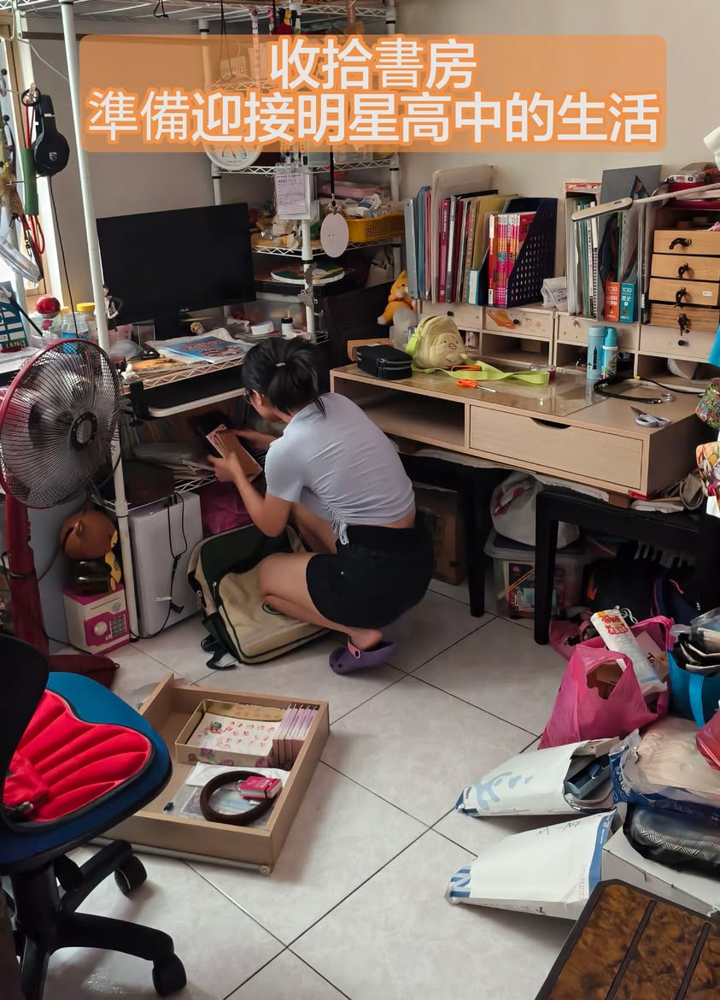

向來都很做自己的小寶，
面對她不想做的事情總是一拖再拖，例如床上堆積如山的未褶衣服。
小寶對待書房的態度亦如此，雖然我一直提醒她高中的書會很多，建議她趁早把用不到的東西清除，但，還沉浸在高分喜悅的小寶，總是遲遲不動手。

6/18 中午會考比序出爐（女生序位736人~850人），她發現她並非穩上北一女時，當她聽到大人們都鼓勵她填附中時，當他知道附中合作社不好吃時，她開始思考人生了，畢竟，她當初只是為了好吃的中山熱食部才努力想要考進中山女高的。
但，不小心考出高於中山的成績後，對於是否要離開她最熟悉最愛的中山去更明星的高中，她真的陷入長考了，她出現了會考前才出現的認真表情了。
昨天下午小寶突然開始收拾書房，連到了晚餐時間也還不想吃飯，這就是小寶，一旦開始做事，就會很認真的小寶，看著她默默收拾的背影，突然間，竟然有股不捨的情感湧上心頭，因為小寶一直以來都是一副遊戲人間的態度，所以我們總是不斷灌她心靈雞湯，希望她上進一點，努力一點，沒想到，當她突然願意接受挑戰時，我們反而有點不太習慣。
話說回來，這不就是我一直想看到的認真的小寶嗎？當孩子自己願意接受挑戰，去追求卓越，父母當然也該樂觀其成呀！

